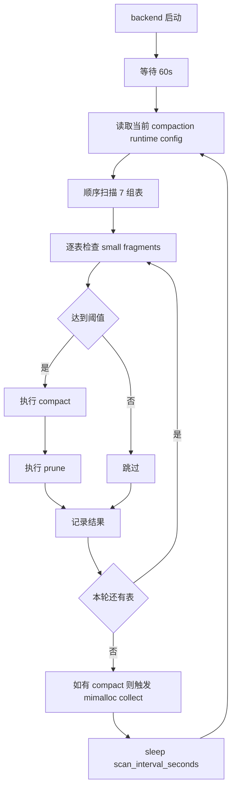
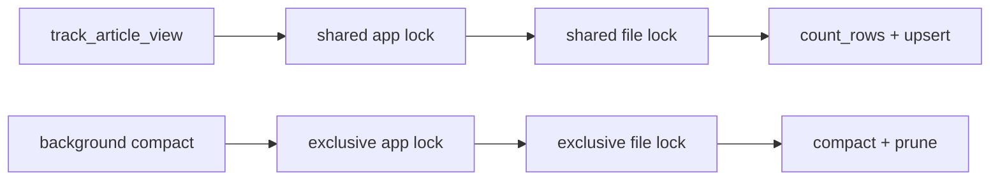

# StaticFlow 后台表压缩任务当前实现：调度、表范围与并发安全

> **Code Version**: 基于当前仓库工作树，时间点为 `2026-03-21`。  
> **讨论范围**: 只覆盖 backend 自动 compactor，不覆盖手工执行的 `sf-cli db optimize ...`。

## 1. 背景与范围

StaticFlow 现在把 LanceDB 表压缩分成两条路径：

- **后台自动 compactor**：backend 常驻任务，按周期扫描并压缩。
- **手工维护命令**：运维或开发者显式执行 `sf-cli db optimize ...`。

这篇文档只解释第一条，也就是 backend 自己的自动压缩任务。重点回答三个问题：

1. 它什么时候跑，怎么决定压不压。
2. 哪些表会参与。
3. 当线上还有读写请求时，它如何保证不会把表压坏。

> 💡 **Key Point**
> 当前实现的目标不是“所有表一律全局串行”，而是：
> - 后台压缩任务自身按表顺序运行，避免一次性并行压多张表。
> - 对两个最热的统计表额外加应用级 shared/exclusive 锁。
> - 其余表主要依赖 Lance 的版本化提交语义，而不是统一的应用级表锁。

---

## 2. 运行时模型

### 2.1 启动方式

后台 compactor 由 `spawn_table_compactor(...)` 启动，是一个独立的 `tokio::spawn` 任务，
入口在 [state.rs](/home/ts_user/rust_pro/static_flow/crates/backend/src/state.rs#L480)。

它不是在 backend 启动后立刻开始工作，而是先等待 `60s`：

- 目的不是节流，而是避开启动期的 schema migration
- 这样能减少和 `connect()` 期间自动补列/建表的竞争

对应实现见 [state.rs](/home/ts_user/rust_pro/static_flow/crates/backend/src/state.rs#L486)。

### 2.2 默认配置

默认配置定义在 [state.rs](/home/ts_user/rust_pro/static_flow/crates/backend/src/state.rs#L52)：

| 参数 | 默认值 | 作用 |
|---|---:|---|
| `enabled` | `true` | 是否启用后台压缩 |
| `scan_interval_seconds` | `180` | 每轮扫描间隔 |
| `fragment_threshold` | `10` | 小 fragment 数量达到多少才压缩 |
| `prune_older_than_hours` | `2` | compaction 后 prune 的保留窗口 |

这些值既可以从环境变量加载，也可以在运行时通过 admin API 修改：

- 环境变量解析： [state.rs](/home/ts_user/rust_pro/static_flow/crates/backend/src/state.rs#L360)
- 管理接口：`GET/POST /admin/compaction-config`，路由在 [routes.rs](/home/ts_user/rust_pro/static_flow/crates/backend/src/routes.rs#L114)

### 2.3 一轮扫描的总体流程

对应的主循环在 [state.rs](/home/ts_user/rust_pro/static_flow/crates/backend/src/state.rs#L508)。

有一个容易忽略的细节：如果这一轮至少 compact 了 1 张表，任务结束前会主动触发一次
`mi_collect(true)`，用于把 compaction 过程中堆起来的大块内存尽快还给 allocator。
代码见 [state.rs](/home/ts_user/rust_pro/static_flow/crates/backend/src/state.rs#L627)。

---

## 3. 单表压缩决策路径

### 3.1 入口与结果模型

真正的单表逻辑在 [optimize.rs](/home/ts_user/rust_pro/static_flow/crates/shared/src/optimize.rs#L103)。

`scan_and_compact_tables(...)` 会按传入的表名顺序逐个处理，每张表返回一个 `CompactResult`，
其中包含：

- 表名
- 识别到的 small fragment 数量
- 实际动作类型
- 是否真的发生 compact
- 失败原因

动作枚举定义在 [optimize.rs](/home/ts_user/rust_pro/static_flow/crates/shared/src/optimize.rs#L36)。

### 3.2 small fragment 的定义

当前实现不是靠 `ls data/ | wc -l` 这类文件数统计判断碎片，而是直接打开 dataset，
遍历 fragment 元数据，统计 `physical_rows < 100000` 的 fragment 数量。代码在
[optimize.rs](/home/ts_user/rust_pro/static_flow/crates/shared/src/optimize.rs#L260)。

这点很重要，因为在 blob v2 表里：

- `.lance` 数据文件
- `.blob` sidecar 文件

都会出现在 `data/` 目录下。用文件数估 fragment 会把 blob sidecar 误算进去。

> 💡 **Key Point**
> 当前阈值判断基于“fragment 行数”，不是“目录里文件数”。
> 这对 `songs`、`images`、`interactive_assets` 这类 blob v2 表尤其关键。

### 3.3 maintenance 路径与 safe fallback

当 small fragment 数达到阈值后，后台会调用 `compact_table_with_fallback(...)`，
实现位于 [optimize.rs](/home/ts_user/rust_pro/static_flow/crates/shared/src/optimize.rs#L74)。

这一步分两层：

1. 先调用 `repair_missing_frag_reuse_index()`，修补历史遗留的 `frag_reuse` 元数据问题。
2. 再执行真正的 `OptimizeAction::Compact`。

默认的 maintenance compaction 参数是：

- `num_threads = 1`
- `batch_size = 1024`
- `defer_index_remap = !table_uses_stable_row_ids(table)`

代码在 [optimize.rs](/home/ts_user/rust_pro/static_flow/crates/shared/src/optimize.rs#L281)。

由于当前生产库的表都已经迁成 stable row id，所以这条判断在现网基本等价于：

- `defer_index_remap = false`

如果 compact 报的是 `Offset overflow error`，后台不会直接放弃，而是切到更保守的
fallback 参数：

- `batch_size = 8`
- `max_rows_per_group = 8`
- `max_bytes_per_file = 512MB`
- `num_threads = 1`

代码在 [optimize.rs](/home/ts_user/rust_pro/static_flow/crates/shared/src/optimize.rs#L223)。

### 3.4 prune 策略

compact 成功后会立刻做一次 prune，默认参数是：

- `older_than = 2h`
- `delete_unverified = false`
- `error_if_tagged_old_versions = false`

实现见 [optimize.rs](/home/ts_user/rust_pro/static_flow/crates/shared/src/optimize.rs#L86) 和
[optimize.rs](/home/ts_user/rust_pro/static_flow/crates/shared/src/optimize.rs#L200)。

这意味着后台 compactor 不是“compact 完就把所有旧版本立刻删光”，而是保留一个
有限窗口，降低长尾读请求与版本切换撞上的概率。

---

## 4. 参与 compaction 的表

### 4.1 表组划分

后台每轮会顺序扫描 7 组表，调度逻辑在
[state.rs](/home/ts_user/rust_pro/static_flow/crates/backend/src/state.rs#L558)。

| DB 组 | 表名来源 | 表 |
|---|---|---|
| Content 主内容组 | [lancedb_api.rs](/home/ts_user/rust_pro/static_flow/crates/shared/src/lancedb_api.rs#L239) | `articles`, `images`, `taxonomies`, `article_views`, `api_behavior_events` |
| Content 请求组 | [article_request_store.rs](/home/ts_user/rust_pro/static_flow/crates/shared/src/article_request_store.rs#L111) | `article_requests`, `article_request_ai_runs`, `article_request_ai_run_chunks` |
| Content 交互镜像组 | [interactive_store.rs](/home/ts_user/rust_pro/static_flow/crates/shared/src/interactive_store.rs#L25) | `interactive_pages`, `interactive_page_locales`, `interactive_assets` |
| Content LLM gateway 组 | [llm_gateway_store/mod.rs](/home/ts_user/rust_pro/static_flow/crates/shared/src/llm_gateway_store/mod.rs#L30) | `llm_gateway_keys`, `llm_gateway_usage_events`, `llm_gateway_runtime_config` |
| Comments 组 | [comments_store.rs](/home/ts_user/rust_pro/static_flow/crates/shared/src/comments_store.rs#L209) | `comment_tasks`, `comment_published`, `comment_audit_logs`, `comment_ai_runs`, `comment_ai_run_chunks` |
| Music 主表组 | [music_store.rs](/home/ts_user/rust_pro/static_flow/crates/shared/src/music_store.rs#L42) | `songs`, `music_plays`, `music_comments` |
| Music wish 组 | [music_wish_store.rs](/home/ts_user/rust_pro/static_flow/crates/shared/src/music_wish_store.rs#L109) | `music_wishes`, `music_wish_ai_runs`, `music_wish_ai_run_chunks` |

合起来是 25 张表。

### 4.2 Content 主内容组的特殊处理

Content 主内容组不是一把梭全交给通用扫描器。

当前实现把它拆成两段：

- `articles`, `images`, `taxonomies` 走通用 `scan_and_compact_tables(...)`
- `article_views`, `api_behavior_events` 走 `StaticFlowDataStore` 里的专门路径

拆分逻辑在 [lancedb_api.rs](/home/ts_user/rust_pro/static_flow/crates/shared/src/lancedb_api.rs#L559)。

原因很直接：这两个表是 backend 高频热表，除了 compact，还存在大量在线查询和追加写入，
因此需要额外的应用级并发保护。

---

## 5. 并发安全模型

### 5.1 第一层：Lance 的版本化提交语义

对所有表都成立的基础保证来自 Lance 自己：

- 写入和 compaction 最终都是通过新版本 manifest 提交
- 读请求不会看到“半个 fragment 已换、新 manifest 还没切”的中间状态
- prune 不是和 compact 合成一个不可分的动作，而是后续清理旧版本

也就是说，哪怕没有额外应用锁，backend 一般也不会把表读到物理层半完成状态。

但这层保证只回答“会不会读到半成品”，不回答“会不会和在线写流量互相抢占资源、
放大冲突概率”。这就是第二层锁存在的原因。

### 5.2 第二层：热表的 shared/exclusive 维护锁

当前只有两个热表接入了应用层并发门控：

- `article_views`
- `api_behavior_events`

它们在 `StaticFlowDataStore` 里各自持有一个进程内 `tokio::sync::RwLock<()>`：

- `article_views_gate`
- `api_behavior_gate`

定义在 [lancedb_api.rs](/home/ts_user/rust_pro/static_flow/crates/shared/src/lancedb_api.rs#L246)。

同时，这两个表还会在 `/tmp/staticflow-table-locks/<table>.lock` 上再拿一层
OS 级文件锁，支持跨 backend 进程同步。锁实现见
[lancedb_api.rs](/home/ts_user/rust_pro/static_flow/crates/shared/src/lancedb_api.rs#L3185)。

### 5.3 共享模式与独占模式的真实含义

这里的 `read()` / `write()` 不是“数据库只读 / 数据库只写”的字面意义，而是：

- **Shared 模式**：在线流量可以并发进入
- **Exclusive 模式**：维护任务独占表访问

最典型的例子：

- `track_article_view(...)` 是写路径，但它拿的是 `article_views_gate.read()` 和
  shared file lock。[lancedb_api.rs](/home/ts_user/rust_pro/static_flow/crates/shared/src/lancedb_api.rs#L656)
- `append_api_behavior_events(...)` 也是写路径，但它拿的是 `api_behavior_gate.read()`
  和 shared file lock。[lancedb_api.rs](/home/ts_user/rust_pro/static_flow/crates/shared/src/lancedb_api.rs#L373)

相反，真正的维护动作会拿 exclusive：

- `compact_article_views_table()`：[lancedb_api.rs](/home/ts_user/rust_pro/static_flow/crates/shared/src/lancedb_api.rs#L542)
- `compact_api_behavior_table()`：[lancedb_api.rs](/home/ts_user/rust_pro/static_flow/crates/shared/src/lancedb_api.rs#L525)
- `cleanup_api_behavior_before()`：[lancedb_api.rs](/home/ts_user/rust_pro/static_flow/crates/shared/src/lancedb_api.rs#L498)
- 后台自动 `check_and_compact_article_views/api_behavior(...)`：
  [lancedb_api.rs](/home/ts_user/rust_pro/static_flow/crates/shared/src/lancedb_api.rs#L574)

这套设计的效果是：

- 多个在线请求彼此可以并发
- 维护任务会等在线请求流量先释放 shared guard
- 一旦维护任务拿到 exclusive guard，新在线请求会在应用层等待，不会和 compact 并行撞表

### 5.4 其余 20 张表的边界

对 `articles`, `images`, `songs`, `interactive_assets`, `comment_*`, `article_requests*` 等
其余 20 张表，当前**没有统一的应用级 shared/exclusive 表锁**。

这意味着这些表的安全性主要依赖三件事：

1. Lance 的版本化提交语义
2. compactor 自己按表顺序处理，不在同一 backend 内并行压多张表
3. compact 的 fallback 和 stable row id / index remap 机制，尽量降低大表重写时的失败概率

> ⚠️ **Gotcha**
> 当前实现的并发保护是“分层且不对称”的：
> - `article_views` / `api_behavior_events`：有强应用层门控
> - 其它表：没有统一门控，只靠存储层语义和顺序调度
>
> 所以如果问题是“线上流量与后台维护会不会绝对串行”，答案是否定的；
> 只有两个热统计表做到了这一点。

---

## 6. 典型并发场景

### 6.1 `article_views` 在线计数与 compact 同时发生

这是当前保护最完整的场景。

当 `track_article_view` 已经在跑时，compact 需要等 shared guard 释放。  
当 compact 已经拿到 exclusive guard 时，新的 `track_article_view` 会在 guard 上等待。

这里的目标不是序列化每一次 view upsert，而是**把维护动作从在线流量里隔离出去**。

### 6.2 `songs` 或 `images` 在线写入与 compact 同时发生

这是当前保护较弱的场景。

后台会直接打开表并尝试 compact，[optimize.rs](/home/ts_user/rust_pro/static_flow/crates/shared/src/optimize.rs#L145)；
不会先去拿像 `article_views_gate` 那样的应用层锁。

因此：

- backend/worker 的在线写入不会先被应用层拦住
- 是否能和平共存，主要取决于 Lance 的版本化提交和内部冲突处理
- 这类场景更接近“存储层可恢复的竞争”，而不是“应用层严格串行”

这也是为什么当前实现更强调：

- stable row id
- compaction fallback
- compaction 前修复 `frag_reuse`

而不是宣称“所有表都被同一套锁完美覆盖”。

### 6.3 多个 backend 进程同时运行

跨进程同步当前也只对两个热表生效，因为文件锁逻辑只接在：

- `article_views`
- `api_behavior_events`

相关实现都在 [lancedb_api.rs](/home/ts_user/rust_pro/static_flow/crates/shared/src/lancedb_api.rs#L3185)。

所以如果同时起两个 backend：

- 对 `article_views/api_behavior_events`，维护动作会通过 `.lock` 文件互斥
- 对其它表，没有统一的跨进程表级文件锁

---

## 7. 设计取舍与后续方向

### 7.1 当前方案解决了什么

- 后台 compaction 有统一调度，不再靠人工定期执行
- 所有 25 张表都纳入自动扫描范围
- 热统计表的维护动作和在线流量实现了明确隔离
- blob v2 表已经纳入正常 compaction，而不是单独跳过

### 7.2 当前方案刻意没做什么

- 没有把 25 张表都纳入同一套 shared/exclusive 表锁框架
- 没有把所有在线写入都变成“维护期绝对串行”
- 没有引入更重的全局调度器或跨 store 统一锁管理器

这种取舍换来的好处是实现简单、改动面小；代价是并发保护强度不一致。

### 7.3 如果要继续加强

最直接的演进方向是把当前 hot-table 的锁模型抽象成通用表访问门面：

1. 所有表定义统一的 `Shared` / `Exclusive` 访问模式
2. 读流量、在线写流量、维护流量分别声明自己的模式
3. compactor 和 worker 统一通过同一层门面拿锁

这样才能把“线程安全”从两个特殊表扩展成全表一致的策略。

---

## 8. Code Index

| 路径 | 位置 | 作用 |
|---|---|---|
| [crates/backend/src/state.rs](/home/ts_user/rust_pro/static_flow/crates/backend/src/state.rs#L480) | `spawn_table_compactor` | 后台 compactor 启动、主循环、shutdown、mimalloc collect |
| [crates/backend/src/state.rs](/home/ts_user/rust_pro/static_flow/crates/backend/src/state.rs#L52) | 默认常量 | compaction 默认扫描周期、阈值、prune 窗口 |
| [crates/backend/src/state.rs](/home/ts_user/rust_pro/static_flow/crates/backend/src/state.rs#L360) | `read_compaction_runtime_config_from_env` | 从环境变量读取启动配置 |
| [crates/backend/src/routes.rs](/home/ts_user/rust_pro/static_flow/crates/backend/src/routes.rs#L114) | `/admin/compaction-config` | 运行时查询/修改 compaction 配置 |
| [crates/shared/src/optimize.rs](/home/ts_user/rust_pro/static_flow/crates/shared/src/optimize.rs#L103) | `scan_and_compact_tables` | 通用逐表扫描入口 |
| [crates/shared/src/optimize.rs](/home/ts_user/rust_pro/static_flow/crates/shared/src/optimize.rs#L159) | `check_opened_table_and_compact` | 单表阈值判断、compact、prune |
| [crates/shared/src/optimize.rs](/home/ts_user/rust_pro/static_flow/crates/shared/src/optimize.rs#L213) | `optimize_compaction_with_fallback` | maintenance 路径和 offset overflow fallback |
| [crates/shared/src/optimize.rs](/home/ts_user/rust_pro/static_flow/crates/shared/src/optimize.rs#L260) | `count_small_fragments` | 基于 fragment 行数判断 small fragment |
| [crates/shared/src/lancedb_api.rs](/home/ts_user/rust_pro/static_flow/crates/shared/src/lancedb_api.rs#L246) | `StaticFlowDataStore` | `article_views` / `api_behavior_events` 的应用级 gate |
| [crates/shared/src/lancedb_api.rs](/home/ts_user/rust_pro/static_flow/crates/shared/src/lancedb_api.rs#L559) | `scan_and_compact_managed_content_tables` | Content 主内容组的特殊分流逻辑 |
| [crates/shared/src/lancedb_api.rs](/home/ts_user/rust_pro/static_flow/crates/shared/src/lancedb_api.rs#L3185) | `acquire_table_access_file_lock` | 基于 `/tmp/staticflow-table-locks` 的跨进程文件锁 |

## 9. 总结

StaticFlow 当前的后台 compaction 机制，核心上是一个**碎片驱动、顺序扫描、失败可降级**
的维护任务。它已经覆盖全部 25 张表，并且 blob v2 表也进入了正常 compact 路径。

但并发安全不是“一刀切”的：  
真正做到“在线流量与维护流量显式隔离”的，当前只有 `article_views` 和
`api_behavior_events`。其它表更多依赖 Lance 本身的版本化提交语义，而不是统一的
应用级表锁。这是当前实现最重要的设计边界。  
