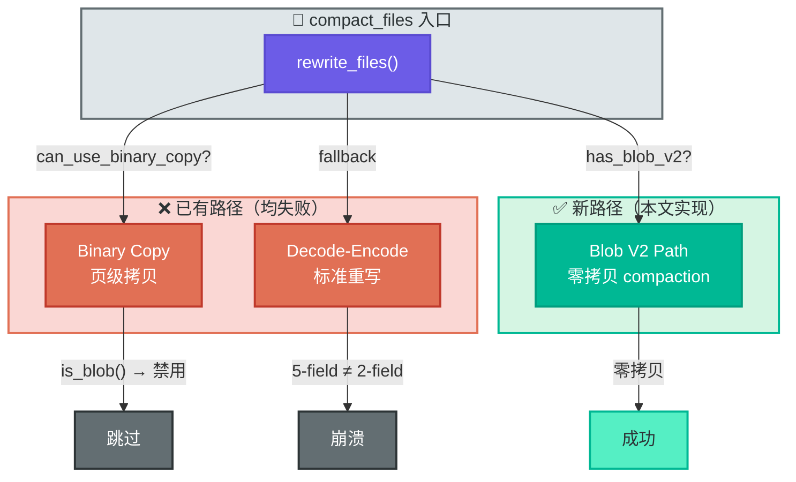
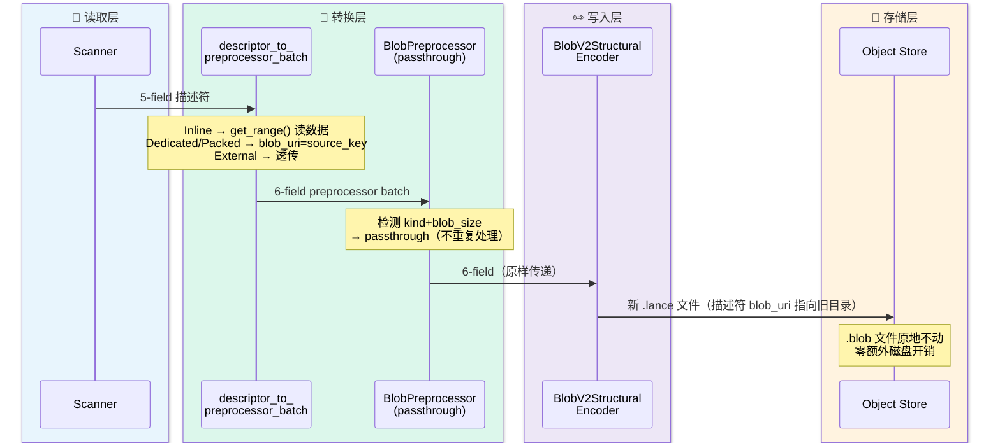
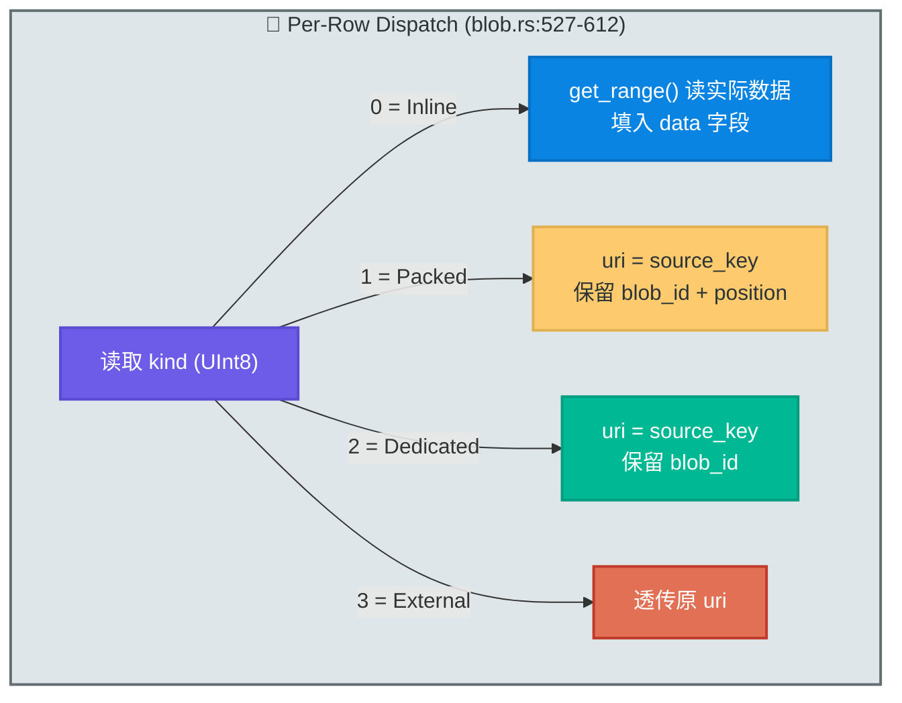

# Lance Blob V2 零拷贝 Compaction 深度解析

> **代码版本**: 基于 `acking-you/lance` fork, branch `feat/static-flow`
> **适用场景**: 包含大型二进制数据（音频、图片）的 Lance 数据集 compaction
>
> **状态更新（2026-03-21）**:
> 本文前半部分先从“上游尚不支持 blob v2 compaction”的故障现场展开，这是历史背景。
> 当前 StaticFlow fork 已实现并验证 blob v2 compaction，生产中的 `songs`、`images`
> 与 `interactive_assets` 都可以正常执行 compaction。

### 导航

| 章节 | 一句话 |
|---|---|
| §1 | 从存储优化到 compaction 困境 |
| §2 | Blob V2 核心概念：描述符、Schema 二象性、data_file_key |
| §3 | 困境：官方两条 compaction 路径均失败 |
| §4 | 方案演进：从 sidecar 拷贝到零拷贝 |
| §5 | 实现详解：逐层构建零拷贝管线 |
| §6 | 设计决策与权衡 |
| §7 | 测试策略与 E2E 验证 |
| §8 | Code Index |

---

## 1. 引言：从存储优化到 Compaction 困境

StaticFlow 音乐模块需要存储 ~500 首歌 × 10MB/首的音频数据。
最初使用 blob v1 模式，音频混在 `.lance` 列式文件里，导致磁盘膨胀到 **27GB**。
迁移到 blob v2（`data_storage_version=2.2`）后，音频作为 `.blob` sidecar 文件
独立存放，存储降到 **4.7GB**——但随之暴露了新问题：

每首歌通过 `append` 写入产生一个独立的 fragment。500 首歌 = 500 个 fragment，
查询性能线性下降。**Compaction**（合并小 fragment）是必须的。本文就是从当时
“lance 上游尚不支持含 blob v2 列的 compaction”（[issue #4947](https://github.com/lancedb/lance/issues/4947)）
这个起点出发，解释后来在 fork 中如何把它补齐的。

> 关于 blob v1 → v2 的完整迁移过程、存储原理对比、和 fork 决策，
> 详见 [LanceDB Blob 存储演进实战](./lancedb-blob-storage-optimization-journey.md)。

**本文聚焦**：如何在 lance fork 中实现 blob v2 **零拷贝 compaction**——
让 compaction 过程中 `.blob` 音频文件一个字节都不拷贝，峰值磁盘开销从 2× 降到 ~0。

> Blob v2 社区原始提案文档（参考）：[Blob v2 Design Doc](https://docs.google.com/document/d/1JckrGy5dGSd43MNj5g2YQZoyx66aBzCLz3j6yqTS_nA/edit?tab=t.0)

---

## 2. 前置知识：Blob V2 核心概念

本文后续章节依赖几个 blob v2 的核心概念，此处精简介绍。
完整原理见前序文章的第三、四章。

### 2.1 BlobKind 与描述符

Blob V2 将数据与元数据分离：`.lance` 列式文件只存 **30 字节/行的描述符**，
实际数据根据大小分到 4 种 `BlobKind`（`datatypes.rs:434-446`）：

| BlobKind | 条件 | 数据位置 |
|----------|------|----------|
| Inline (0) | ≤ 64KB | 嵌入 `.lance` 文件末尾 |
| Packed (1) | 64KB ~ 4MB | 多行共享一个 `.blob` sidecar |
| Dedicated (2) | > 4MB | 独立 `.blob` sidecar（一行一文件） |
| External (3) | 用户提供 URI | 不存储，只记录外部 URI |

每行描述符有 5 个字段（`datatypes.rs:50-58`），以一首 10MB MP3 为例：

```
5-field 描述符 (磁盘格式):
  kind=2(Dedicated)  position=0  size=10485760  blob_id=0  blob_uri=""
```

### 2.2 Schema 二象性

**用户侧**看到的是 2 字段：`Struct<data: Binary, uri: Utf8>`。
**磁盘侧**存储的是 5 字段：`Struct<kind, position, size, blob_id, blob_uri>`。

> 💡 **Key Point** — 这两套 schema 的不匹配，是写入管线适配（§5.2–5.3）的核心挑战。

### 2.3 data_file_key

每个 `.lance` 数据文件有唯一标识 `data_file_key`（文件名去掉 `.lance` 后缀）。
Blob sidecar 路径由它构成：`data/{data_file_key}/{blob_id}.blob`。

> ⏭️ 零拷贝方案的核心思路就是复用这个字段——把源 `data_file_key` 写进
> 描述符的 `blob_uri`，让新 fragment 的读取路径指向旧目录的 `.blob` 文件。
> 详见 §4.4。

---

## 3. 困境：官方两条 Compaction 路径均失败

`compact_files()` 内部有两条已有的执行路径。对于含 blob v2 列的数据集，
两条都走不通：



**路径 1 — Binary Copy（页级拷贝）**：检测到 `is_blob() == true` 直接跳过
（`optimize.rs:261-267`）。页级拷贝无法处理 `.blob` sidecar 文件，这是正确的保护。

**路径 2 — Decode-Encode（标准重写）**：两个致命问题——
- **Schema 不匹配**：Scanner 以 `BlobsDescriptions` 模式输出 5-field 描述符，
  但 `write_fragments_internal` 期望 2-field 逻辑结构 → 直接报错
- **内存不可控**：即使 schema 问题能解决，500 首歌 × 10MB = 5GB 全加载进
  Arrow RecordBatch，不可接受

两条路都走不通，所以需要新建第三条路径——即本文实现的 Blob V2 零拷贝 compaction。

### 根本矛盾

标准 compaction 假设所有数据都是轻量列式数据（几十 KB/行），
但 blob v2 的 Dedicated 模式单行可达数十 MB。用列式思维处理大文件级数据——**范式不匹配**。

---

## 4. 方案演进：从拷贝到零拷贝

方案不是一步到位想出来的。每一步的失败指向了下一步的方向。

### 4.1 Sidecar 拷贝（描述符级重写 + object_store.copy）

§3 的分析指出 Decode-Encode 的两个死穴：内存爆炸和 schema 不匹配。
自然的第一反应是——**不读实际数据**，只读描述符（30B/行），
用 `object_store.copy()` 把 `.blob` 文件拷到新 fragment 目录。

```
compact 前: data/aaa/0.blob (10MB) + data/bbb/0.blob (10MB)
compact 后: data/ccc/0.blob (10MB) + data/ccc/1.blob (10MB)  ← 拷贝
            data/aaa/0.blob + data/bbb/0.blob                ← 待 GC 删除
峰值: 2× 原始大小
```

内存问题解决了，但**磁盘问题没有**：500 首歌 × 10MB = 5GB，峰值 10GB。
在 WSL2 的 9P 桥接下拷贝速度更慢，空间更紧张。

问题的根源在于"拷贝"本身——能不能完全不拷贝？

### 4.2 硬链接

既然拷贝开销太大，最直接的零拷贝手段是 `std::fs::hard_link()`——
创建文件引用，不拷贝数据，O(1) 操作。

但 WSL2 的 9P 文件系统桥接（Linux → Windows NTFS）**不支持硬链接**。
数据目录挂载在 `/mnt/e/`，这条路死了。

> 如果你的数据在 Linux 原生文件系统上，硬链接是最简单的方案。

硬链接的思路本质上是"让新 fragment 引用旧文件"。
文件系统级别做不到，能不能在 lance 格式层面做到？

### 4.3 共享 Blob 池（类 RocksDB BlobDB）

借鉴 RocksDB BlobDB 的设计：所有 blob 文件放进共享池目录
`_blobs/{global_id}.blob`，与 fragment 彻底解耦。
Compaction 只需重写描述符，blob 文件永远不动。

这个思路是对的——**不动 blob 文件，只改描述符**。
但实现代价太高：需要改变路径结构、持久化全局 ID 计数器、不向后兼容、侵入性大。

能不能保留"只改描述符"的思路，但**不改路径结构**？

### 4.4 blob_uri 引用 + blob_source_keys（最终方案）

答案是复用描述符中**已有的** `blob_uri` 字段。

回忆 §2.3 的 `data_file_key`——每个 `.lance` 文件的唯一标识。
零拷贝方案把源 fragment 的 `data_file_key` 写入 `blob_uri`，
让读取路径"去那个旧目录找 blob 文件"。不需要新路径结构，不需要全局 ID。

```
Compaction 前:
  Fragment 0: data/aaa.lance → {kind:2, blob_id:0, blob_uri:""}
              data/aaa/0.blob (10MB)
  Fragment 1: data/bbb.lance → {kind:2, blob_id:0, blob_uri:""}
              data/bbb/0.blob (10MB)

Compaction 后（零拷贝）:
  Fragment 2: data/ccc.lance → 2 行描述符:
    row 0: {kind:2, blob_id:0, blob_uri:"aaa"}  ← 指向 data/aaa/0.blob
    row 1: {kind:2, blob_id:0, blob_uri:"bbb"}  ← 指向 data/bbb/0.blob

  data/aaa/0.blob (10MB) ← 没动！
  data/bbb/0.blob (10MB) ← 没动！
```

只写了一个新的 `data/ccc.lance`（几 KB 元数据）。20MB 的 `.blob` 文件原封不动。

### 4.5 方案对比

| 维度 | Sidecar 拷贝 | 硬链接 | 共享 Blob 池 | **零拷贝** |
|------|-------------|--------|-------------|-----------|
| 峰值内存 | 低 | 低 | 低 | **低** |
| 峰值磁盘 | 2× | 1× | 1× | **~1×** |
| 格式变更 | 无 | 无 | 大 | **无**（复用已有字段） |
| 向后兼容 | ✅ | ✅ | ❌ | **✅** |
| 跨文件系统 | ✅ | ❌ (9P) | ✅ | **✅** |

### 4.6 社区原始提案语境下的 Dedicated 取舍

结合社区原始 Blob v2 提案文档可以看到，第一阶段优先的是统一 blob 的读写语义与事务行为；
而在 compaction / vacuum 的可达性跟踪上，文中明确写到当前方案不追踪
BlobManifest，并把 BlobManifest 放在 `Future possibilities`。同时，
`Unresolved questions` 里也在讨论 Dedicated 与 Packed 的边界，这说明
Dedicated 的完整生命周期治理并不是第一阶段就闭环的目标。

StaticFlow 的场景刚好相反：它是 local-first、本地自管的数据系统，
音频大对象是主路径，不是边缘路径。真正的瓶颈是 fragment 膨胀后的查询退化，
以及 compact 时的磁盘峰值开销。因此这里采用了一个更贴近当前问题的落地策略：
先用 `blob_uri` + `blob_source_keys` 打通 Dedicated 的零拷贝 compaction，
先解决可用性与成本问题，再把更通用的 BlobManifest 方案留到后续演进。

---

## 5. 实现详解：逐层构建零拷贝管线

确定了方案思路后，实现的核心挑战是：如何把这个"只改地址"的想法
嵌入 lance 已有的写入管线。本章按数据流顺序逐层展开。

### 5.1 全局数据流



Lance 的写入管线有三种 schema 格式，分别出现在不同阶段：

```
用户输入 (2-field)        Preprocessor 中间态 (6-field)         磁盘存储 (5-field)
┌──────────────────┐     ┌──────────────────────────────┐     ┌──────────────────────────┐
│ data: Binary     │     │ kind:      UInt8             │     │ kind:     UInt8           │
│ uri:  Utf8       │     │ data:      LargeBinary  ←新增│     │ position: UInt64          │
└──────────────────┘     │ uri:       Utf8              │     │ size:     UInt64          │
                         │ blob_id:   UInt32       ←新增│     │ blob_id:  UInt32          │
  用户传入原始数据          │ blob_size: UInt64      ←新增│       │ blob_uri: Utf8            │
  和可选的外部 URI         │ position:  UInt64      ←新增│     └──────────────────────────┘
                         └──────────────────────────────┘
                           Preprocessor 根据数据大小                Encoder 去掉 data，
                           决定 BlobKind，分配 blob_id，             写入最终描述符
                           保留原始 data 供 Encoder 写入 .blob
```

6-field 是 `BlobPreprocessor` 的**输出格式**——它在 2-field 基础上增加了 4 个元数据字段
（`kind`、`blob_id`、`blob_size`、`position`），同时保留了原始 `data`，
让 Encoder 知道该用哪种 BlobKind 写入、以及实际数据内容。
Encoder 消费完 `data`（写入 `.blob` 文件）后丢弃它，最终磁盘上只剩 5-field 描述符。

理解了这三种格式，就能看清正常写入管线的数据流：

```
用户 batch (2-field) → BlobPreprocessor → 6-field → Encoder → 磁盘 (5-field)
```

Compaction 做的事情是"合并多个旧 fragment 为一个新 fragment"——
读出旧数据是第一步，但最终还是要**写出新 fragment**。
Lance 没有专门的 compaction 写入路径，写新 fragment 复用的就是上面这条写入管线
（`write_fragments_internal`）。这就产生了格式冲突：

- 从磁盘**读出来**的是 5-field 描述符
- 写入管线**期望接收**的是 2-field（或经过 Preprocessor 后的 6-field）

所以我们需要在管线前面插入一个转换层，
把 5-field 变成 6-field，"假装"它是 preprocessor 的输出：

```
磁盘 (5-field) → descriptor_to_preprocessor_batch → 6-field → Preprocessor(透传) → Encoder → 磁盘 (5-field)
```

接下来按这条管线的顺序，逐层讲解实现。

### 5.2 第一层：描述符转换 — descriptor_to_preprocessor_batch

这是整个零拷贝 compaction 的核心函数（`blob.rs:451-660`）。
它接收 scanner 输出的 5-field 描述符，按 BlobKind 分别处理，
输出 6-field preprocessor 格式。

#### 5→6 字段映射

5-field 磁盘格式里没有 `data` 字段——实际数据在 `.blob` sidecar 文件里。
转换为 6-field 时，`data` 字段的填充方式取决于 BlobKind：

| BlobKind | data 字段 | uri 字段 | 为什么 |
|----------|----------|---------|-------|
| Inline | `get_range()` 从旧 `.lance` 读出实际字节 | null | 数据嵌在 `.lance` 文件里，必须读出来让 Encoder 重新 inline |
| Packed / Dedicated | **null** | 写入 `source_data_file_key` | 数据在 `.blob` sidecar 里，不读不拷——这就是零拷贝 |
| External | null | 透传原 uri | 数据在外部，本来就不存储 |

Encoder 收到 6-field 后的行为也因此不同：
- `data` 有值（Inline）→ Encoder 把数据写入新 `.lance` 文件末尾，正常流程
- `data` 为 null 但 `kind`/`blob_size` 已设置（Dedicated/Packed）→ Encoder
  只写 5-field 描述符到新 `.lance` 文件，**不创建新的 `.blob` 文件**。
  描述符里的 `blob_uri` 保留了 source_key，读取时据此找到旧目录的 `.blob` 文件

> 💡 **Key Point** — 零拷贝的核心就在这里：Dedicated/Packed 的 `data` 为 null，
> Encoder 因此跳过了 `.blob` 写入，只写几十字节的描述符。整条管线照常运转，
> 但 `.blob` 文件一个字节都没动。

其余字段的映射：

```
5-field (磁盘)           6-field (preprocessor)      转换规则
─────────────────────────────────────────────────────────────
kind     (UInt8)    →    kind     (UInt8)            直接复制
position (UInt64)   →    position (UInt64)           Inline: 置 null; 其余: 透传
size     (UInt64)   →    blob_size(UInt64)           改名
blob_id  (UInt32)   →    blob_id  (UInt32)           Dedicated/Packed: 保留; Inline: 0
blob_uri (Utf8)     →    uri      (Utf8)             改名; Dedicated/Packed: 写 source_key
```

#### 四路分派

以一个 4 行 batch 为例（`source_data_file_key = "abc123"`）：



Dedicated/Packed 两种模式是零拷贝的关键分支——它们不读取实际 blob 数据，
只把 `source_data_file_key` 写入 `uri` 字段。函数同时返回一个 `HashSet<String>`
记录所有被引用的 source key，用于后续 GC 保护（⏭️ §5.5）。

#### 多轮 Compaction 的幂等性

如果数据已经 compact 过一次（`blob_uri` 已经有值），再次 compact 时怎么办？

```rust
// blob.rs:563-568 (Packed 分支，Dedicated 同理)
let source_key = if !blob_uri.is_empty() {
    blob_uri.to_string()     // 已经 compact 过 → 透传旧值
} else {
    source_data_file_key.to_string()  // 首次 compact → 记录当前 key
};
```

`blob_uri` 是物理位置的**稳定指针**——不管 compact 多少轮，它始终指向
blob 文件最初被写入的那个目录：

```
Round 0 (原始写入):  blob_uri=""     → data/aaa/0.blob
Round 1 (首次 compact): blob_uri="aaa"  → data/aaa/0.blob ← 没动
Round 2 (再次 compact): blob_uri="aaa"  → data/aaa/0.blob ← 还是没动
```

### 5.3 第二层：写入管线适配

转换后的 6-field batch 要通过 lance 的标准写入管线 `write_fragments_internal`。
这里有两道关卡需要打通，实现过程中各踩了一个坑。

#### 关卡 1：Schema 兼容性检查

`write_fragments_internal` 会拿输入 batch 的 schema 和 `dataset.schema()` 做兼容性检查。
我们的 batch 是 6-field，但 dataset schema 的 blob 列是 2-field → 字段数不匹配 → 报错。

**解决方案**：构造一个"假的" schema，把 blob 列的 children 替换成 6 个
preprocessor 字段，同时传 `dataset=None` 绕过兼容性检查（`blob.rs:666-712`）。

```rust
// blob.rs:666-712
pub fn compaction_write_schema(dataset_schema: &Schema) -> Schema {
    let max_field_id = dataset_schema.max_field_id().unwrap_or(0);
    let mut next_id = max_field_id + 1;
    let mut schema = dataset_schema.clone();
    for field in &mut schema.fields {
        if !field.is_blob_v2() { continue; }
        let child_defs: &[(&str, &str)] = &[
            ("kind", "uint8"), ("data", "large_binary"), ("uri", "string"),
            ("blob_id", "uint32"), ("blob_size", "uint64"), ("position", "uint64"),
        ];
        field.children = child_defs.iter().map(|(name, lt)| {
            let child = Field { id: next_id, logical_type: LogicalType::from(*lt), .. };
            next_id += 1;
            child
        }).collect();
    }
    schema
}
```

> ⚠️ **Gotcha** — 这个函数经历了三次修复才稳定：
>
> | 问题 | 症状 | 修复 |
> |------|------|------|
> | Field ID 用 `-1` 占位 | `panic: duplicate field id` | 从 `max_field_id + 1` 递增分配 |
> | Arrow `Utf8` 写成 `"utf8"` | `schema parse error` | Lance 类型名：Utf8→`"string"`, LargeBinary→`"large_binary"` |
> | 传了 `Some(dataset)` | `schema incompatible` | 传 `None` 绕过检查 |

#### 关卡 2：BlobPreprocessor 双重处理

`write_fragments_internal` 内部硬编码调用 `BlobPreprocessor::preprocess_batch()`，
正常写入时它把 2-field 转成 6-field。但我们的输入**已经是 6-field**了——
preprocessor 找不到 `data`/`uri` 顶层字段就会崩溃。

**解决方案**：在 preprocessor 里加 **passthrough 检测**（`blob.rs:231-246`）。

```rust
// 检测到 kind + blob_size 两个字段同时存在 → 已经是 6-field 格式，跳过
if struct_arr.column_by_name("kind").is_some()
    && struct_arr.column_by_name("blob_size").is_some()
{
    new_columns.push(array.clone());
    continue;
}
```

为什么用 `kind` + `blob_size` 双字段检测？**零误报**——只有 6-field preprocessor 格式
同时包含这两个字段（用户 2-field 没有 `kind`，磁盘 5-field 的字段叫 `size` 不是 `blob_size`）。

### 5.4 第三层：FragmentTracker 与异步流水线

Scanner 把多个 fragment 的 batch 拼成一个 stream 输出。
但 `descriptor_to_preprocessor_batch` 需要知道**当前 batch 属于哪个源 fragment**——
因为 Inline blob 要从对应的 `.lance` 文件读数据，Dedicated/Packed 需要对应的 `data_file_key`。

**FragmentTracker**（`optimize.rs:929-972`）基于每个 fragment 的 `physical_rows`
建立累积边界表，将全局行偏移映射到源 fragment：

```
3 个 fragment, 各 100/200/150 行:
  get_info(  0) → key="aaa"   ← Fragment 0
  get_info( 99) → key="aaa"   ← 还在 Fragment 0
  get_info(100) → key="bbb"   ← 进入 Fragment 1
  get_info(300) → key="ccc"   ← 进入 Fragment 2
```

流变换使用 `then()`（`optimize.rs:1124-1153`），因为 Inline blob 的 `get_range()` 是异步操作：

```rust
let transformed = raw_reader.then(move |batch_result| {
    async move {
        let batch = batch_result?;
        let num_rows = batch.num_rows();
        let (src_key, src_path) = tracker.lock().unwrap().get_info(current_row);

        // 核心转换：5-field → 6-field
        let (transformed, batch_keys) =
            descriptor_to_preprocessor_batch(&batch, &schema, &store, &src_key, &src_path)
            .await?;

        blob_keys.lock().unwrap().extend(batch_keys);
        tracker.lock().unwrap().advance(num_rows);
        Ok(transformed)
    }
});
```

> 🤔 **Think About** — 为什么用 `std::sync::Mutex` 不用 `tokio::sync::Mutex`？
> 锁的持有时间 < 1μs（查表 / extend HashSet），不跨越任何 `.await` point。
> `std::sync::Mutex` 在这种场景下性能更好。

### 5.5 第四层：GC 保护

零拷贝之后，新 fragment 的 blob 文件还在旧 fragment 的目录里。
但 compaction 完成后旧 fragment 不再活跃，GC 会把旧目录当作垃圾删除——
**连带里面的 `.blob` 文件一起删掉**，导致新 fragment 读取 blob 时报 `NotFound`。

解决方案是三层防线：

**第一层：Fragment 记录 blob_source_keys**

新增 protobuf 字段（`table.proto:339`），在 compaction 完成后附加到新 fragment：

```rust
// optimize.rs:1173-1179
let keys: Vec<String> = blob_source_keys.lock().unwrap().iter().cloned().collect();
if !keys.is_empty() {
    for frag in &mut new_fragments {
        frag.blob_source_keys = keys.clone();
    }
}
```

**第二层：GC 收集 blob_source_keys**

```rust
// cleanup.rs:277-280
for key in &fragment.blob_source_keys {
    referenced_files.blob_source_keys.insert(key.clone());
}
```

**第三层：GC 检查前跳过受保护的目录**

```rust
// cleanup.rs:523-529
} else if inspection.referenced_files.blob_source_keys
    .contains(data_file_key.as_ref())
{
    Ok(None)  // 保护！不删除
}
```

完整示例：

```
Compact 后: Fragment 2 (data/ccc/, blob_source_keys=["aaa","bbb"])
GC 运行:
  data/aaa/0.blob → key "aaa" 在 blob_source_keys → 跳过 ✅
  data/bbb/0.blob → key "bbb" 在 blob_source_keys → 跳过 ✅
  data/aaa.lance  → 不在保护列表 → 安全删除 🗑️
```

### 5.6 第五层：读取路径适配

写完之后，读取时怎么找到 blob 文件？在 `collect_blob_files_v2`（`blob.rs:1095-1123`）
中加一步 `blob_uri` 判断：

```rust
let data_file_key = if !blob_uri.is_empty() {
    blob_uri                          // 有 blob_uri → 直接用（零拷贝路径）
} else {
    data_file_key_from_path(data_file.path.as_str())  // fallback
};
let path = blob_path(&dataset.data_dir(), data_file_key, blob_id);
```

fallback 保证了**向后兼容**——没有经过零拷贝 compaction 的旧数据集
（`blob_uri` 为空）仍然能正确读取。

### 5.7 最隐蔽的 Bug：Encoder 吞掉 blob_uri

以上五层全部实现后，编译通过，但测试挂了——compact 后读 blob 报 `NotFound`。

排查过程逐层缩小范围：
1. `descriptor_to_preprocessor_batch` 正确写入了 `uri="abc123"` ✅
2. `BlobPreprocessor` passthrough 正常 ✅
3. **磁盘描述符里 `blob_uri` 是空字符串** ❌

元凶是 `BlobV2StructuralEncoder::maybe_encode()`——Dedicated 和 Packed 分支
**硬编码了 `"".to_string()`**：

```rust
// 修复前（lance-encoding/src/encodings/logical/blob.rs）
BlobKind::Dedicated => {
    (BlobKind::Dedicated as u8, 0, blob_size_col.value(i), blob_id_col.value(i),
     "".to_string())   // ← 吞掉了 uri！
}
```

正常写入时 Dedicated blob 的 `uri` 确实是空的，硬编码没问题。但在 compaction 路径里，
`uri` 存着 source_key，被覆盖成空字符串。

**修复**（`lance-encoding/src/encodings/logical/blob.rs:347-380`）：

```rust
BlobKind::Dedicated => {
    let uri = uri_col.value(i).to_string();  // ← 保留原值
    (BlobKind::Dedicated as u8, 0, blob_size_col.value(i), blob_id_col.value(i), uri)
}
```

向后兼容：Arrow 对 null Utf8 值返回空字符串 `""`，所以 `to_string()` 后行为不变。

> 💡 **Key Point** — 这是最隐蔽的 bug 类型：管线上下游都正确，中间某一环节
> 硬编码了"这个字段不可能有值"的假设。复用已有管线时，必须逐层检查每一步的
> **隐含假设**是否仍然成立。

### 5.8 补充：Fragment struct literal 冲击

给 `Fragment` 加 `blob_source_keys: Vec<String>` 字段后，整个 codebase
有 **17 处** struct literal 构造缺少新字段（分布在 8 个文件中），编译 15 个错误。

全部加 `blob_source_keys: Vec::new()` 修复。教训：给核心数据结构加字段时，
先 `cargo check` 看影响范围，不要等写完所有逻辑才编译。

---

## 6. 设计决策与权衡

| 决策点 | 选择 | 备选 | 理由 |
|--------|------|------|------|
| blob_id 处理 | 保留原值，不重映射 | 全局重映射 | 不重映射 → 不需要拷贝。blob_id 在原目录下已唯一 |
| blob_uri 存什么 | source `data_file_key` | 共享 blob 池路径 | 复用已有字段，零格式变更 |
| GC 保护 | `Fragment.blob_source_keys` (protobuf) | 独立文件 / 扫描描述符 | Proto field 最简洁；GC 只读 manifest |
| Schema 兼容 | `compaction_write_schema()` + `dataset=None` | 修改公共 API 加 skip 参数 | 不修改公共 API，侵入性更小 |
| Preprocessor 重入 | `kind` + `blob_size` 双字段 passthrough | 全局 flag / 新函数 | 零误报，不需要额外状态 |
| Inline blob | 重新 inline（读出再写入） | 升级为 Dedicated | Inline ≤ 64KB，I/O 开销有上限；升级浪费文件句柄 |
| Mutex 类型 | `std::sync::Mutex` | `tokio::sync::Mutex` | 持有时间 < 1μs，不跨 await |

### 已知限制

- **GC 粒度**：只要最新 manifest 中某个 fragment 包含 `blob_source_keys`，
  对应的旧目录就不会被 GC。清理只在旧 fragment 被新一轮 compaction
  替换后才会发生。
- **跨 fragment blob_id 不唯一**：同一个 compact 后的 fragment 可能有多行
  `blob_id=0`，但它们的 `blob_uri` 指向不同目录，所以不会冲突。

---

## 7. 测试策略

### 7.1 单元测试矩阵

| 测试 | BlobKind | 场景 | 验证 |
|------|----------|------|------|
| `test_compact_blob_v2_dedicated` | Dedicated | 3 frag × 5MB | 长度 + 首字节 + blob_source_keys 非空 |
| `test_compact_blob_v2_inline` | Inline | 3 frag × 100B | 长度 + 首字节 |
| `test_compact_blob_v2_multi_round` | Dedicated | 5 frag → 2 轮 compact | 多轮后内容仍正确 |
| `test_compact_blob_v2_gc_protection` | Dedicated | compact + cleanup | GC 后 blob 仍可读 |
| `test_compact_blob_columns` | V1 (legacy) | 4 行 × 几字节 | 回归验证旧路径不受影响 |
| `cleanup_blob_v2_sidecar_files` | V2 | cleanup | sidecar 文件正确清理 |

### 7.2 Dedicated 测试核心逻辑

```rust
// optimize.rs:3991
// 写入 3 个 fragment，每个 1 行 × 5MB blob
for i in 0u64..3 {
    let blob_data = vec![i as u8 + 42; 5 * 1024 * 1024];
    // append 产生独立 fragment
}
assert_eq!(dataset.get_fragments().len(), 3);

// Compact: 3 → 1
let metrics = compact_files(&mut dataset, CompactionOptions::default(), None).await?;
assert_eq!(metrics.fragments_removed, 3);
assert_eq!(metrics.fragments_added, 1);

// 验证：每行 blob 数据完整
for i in 0u64..3 {
    let blobs = ds.take_blobs_by_indices(&[i], "audio").await?;
    let content = blobs[0].read().await?;
    assert_eq!(content.len(), 5 * 1024 * 1024);
    assert_eq!(content[0], (i as u8 + 42));  // 首字节签名
}

// 验证：blob_source_keys 非空
let frag = dataset.get_fragments()[0];
assert!(!frag.metadata.blob_source_keys.is_empty());
```

### 7.3 E2E 验证 (sf-cli)

```bash
# 合成数据 E2E：创建 5 首歌 → compact → 验证每首歌的音频
sf-cli db --db-path /tmp/test-blob-v2 test-blob-compact --count 5
# 输出: pass: 5/5, fragments: 5 -> 1

# 真实数据验证：从生产音乐 DB 读取 5 首歌的音频
sf-cli db --db-path /mnt/wsl/data4tb/static-flow-data/lancedb-music verify-audio --limit 5
# 输出: 5/5 songs verified OK
```

---

## 8. Code Index

| 文件 | 行号 | 符号 | 职责 |
|------|------|------|------|
| `crates/shared/src/music_store.rs` | 721-727 | `songs_table()` | StaticFlow 音乐表 blob v2 配置 |
| `protos/table.proto` | 339 | `DataFragment.blob_source_keys` | GC 保护的 protobuf 字段 |
| `lance-core/.../datatypes.rs` | 50-58 | `BLOB_V2_DESC_FIELDS` | 5-field 描述符定义 |
| | 434-446 | `BlobKind` | Inline/Packed/Dedicated/External 枚举 |
| `lance/.../blob.rs` | 231-246 | passthrough 检测 | `kind` + `blob_size` 双字段判断 |
| | 451-660 | `descriptor_to_preprocessor_batch` | **核心**：5→6 field 零拷贝转换 |
| | 666-712 | `compaction_write_schema` | 构造 6-field children 的写入 schema |
| | 1061-1154 | `collect_blob_files_v2` | 读取路径：优先用 blob_uri 定位 sidecar |
| `lance/.../optimize.rs` | 929-972 | `FragmentTracker` | 行偏移 → 源 fragment 映射 |
| | 1100-1193 | blob v2 compaction path | then() 流变换 + blob_source_keys 收集 |
| `lance/.../cleanup.rs` | 69-77 | `ReferencedFiles.blob_source_keys` | GC 保护集合 |
| | 277-280 | `process_manifest` | 收集 fragment 的 blob_source_keys |
| | 523-549 | `path_if_not_referenced` | .blob 文件 GC 检查（含 verified fallback） |
| `lance-encoding/.../blob.rs` | 347-380 | `BlobV2StructuralEncoder` | Dedicated/Packed 保留 uri（§5.7 修复点） |
| `cli/.../db_manage.rs` | — | `test_blob_compact` | sf-cli E2E 测试命令 |
| | — | `verify_audio` | sf-cli 音频验证命令 |
