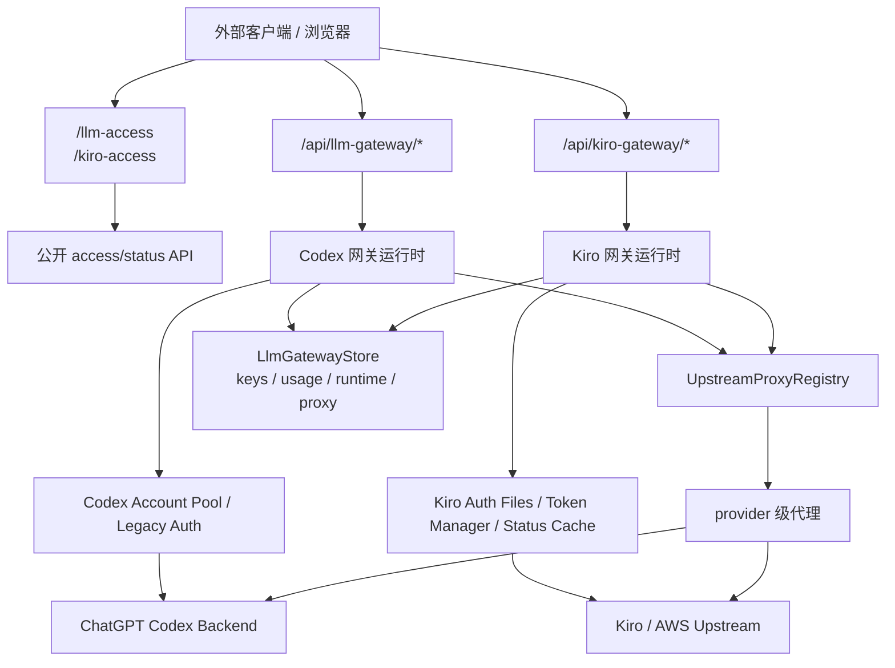

# StaticFlow LLM Access 实现机制：Codex 网关、Kiro 网关与上游代理解析

> **Code Version**: 本文最初基于 `2026-04-01` 的本地 backend 内嵌实现写成。
> **Production Status**: 截至 `2026-05-28`，生产 LLM 流量已经切到 AWS
> Lightsail 上的 standalone `llm-access`。AWS Caddy 将 `/v1/*`、`/cc/v1/*`、
> `/api/llm-gateway/*`、`/api/kiro-gateway/*`、`/api/codex-gateway/*` 和
> `/api/llm-access/*` 直接路由到 `127.0.0.1:19080`。`ackingliu.top` /
> `www.ackingliu.top` 直接解析到 AWS，`staticflow.cc` /
> `www.staticflow.cc` 继续通过 Cloudflare 回同一个 AWS origin。本文的协议、
> 账号、代理、调度和 usage 机制仍然适用；引用 `backend/src/...` 的位置请理解为
> 历史来源或本地兼容/proxy 层，当前生产 source of truth 在 `llm-access*`
> crates 和 cloud `llm-access.service`。
> **讨论范围**: 覆盖 LLM Access 运行时机制，包括 Codex 网关、Kiro 网关、
> 共享代理解析、账号与 key 路由、后台刷新与运维入口；不展开前端视觉设计，
> 也不展开公开申请/赞助流程的业务文案细节。

## 1. 背景与目标

StaticFlow 原本更像一套本地优先的内容系统：文章、图片、评论、音乐、外部内容重发、LanceDB 存储、CLI 写入和自托管部署是 README 里最显眼的部分。当前生产部署仍然保留这种 local-first 内容路径，但 LLM access 已经从本地 backend 热路径中拆出来，成为 AWS 上的单独服务。

但当前仓库实际上已经内建了另一条能力线：

- 对外公开的 Codex 接入页 `/llm-access`
- 对外公开的 Kiro 接入页 `/kiro-access`
- 面向管理员的网关 key、账号、代理绑定与用量面板
- 一套把上游真实账号封装成公开接入层的后端网关

这套实现不是“把前端页面挂上去”那么简单。它背后有三层明确的工程目标：

1. **统一对外协议**  
   Codex 暴露 OpenAI-compatible 接口，Kiro 暴露 Anthropic-compatible 接口，让外部客户端尽量少改配置。
2. **统一内部控制面**  
   两条能力线共享同一套 key 存储、用量账本、运行时配置和 provider 级代理注册表。
3. **保持上游差异可见**  
   Codex 与 Kiro 的真实上游完全不同，所以实现上并不强行抽象成一个“万能 provider”；公共部分只收敛在代理解析、存储和观测层。

这篇文档的目标不是列文件，而是回答四个更实际的问题：

1. 请求从公开页面配置一路走到真实上游，中间经过了哪些运行时层。
2. “llm access” 和 “kiro access” 的代理逻辑到底怎么解析。
3. 两条链路哪些地方共享，哪些地方故意不共享。
4. 当代理、账号或额度出问题时，应该去哪里看。

## 2. 模型与术语

在看具体流程前，先把几个容易混淆的对象固定下来。

| 术语 | 含义 | 当前实现中的位置 |
|---|---|---|
| Public Access Page | 给外部用户看的公开说明页，不直接代理真实上游，只返回接入信息或额度快照 | `frontend/src/pages/llm_access.rs`、`frontend/src/pages/kiro_access.rs` |
| Gateway Key | StaticFlow 自己发放的公开或私有 key，不等于上游真实账号 token | `llm_gateway_keys` |
| Codex Account | 用于访问 ChatGPT Codex backend 的真实账号快照，可来自 `~/.codex/auth.json` 或导入后的账号池 | `backend/src/llm_gateway/accounts.rs` |
| Kiro Auth Record | 用于访问 Kiro/AWS 上游的真实账号记录，保存在独立 auth 文件目录中 | `backend/src/kiro_gateway/auth_file.rs` |
| Upstream Proxy Config | 一个可复用的代理配置项，包含 URL 和可选认证信息 | `llm_gateway_proxy_configs` |
| Proxy Binding | provider 到代理配置项的一对一绑定关系 | `llm_gateway_proxy_bindings` |
| Runtime Config | 网关运行时参数，如 auth cache TTL、请求体大小上限、Kiro 默认调度参数 | `llm_gateway_runtime_config` |
| Usage Event | 每次外部请求对应的一条用量账本记录，用于额度统计和审计 | `llm_gateway_usage_events` |

当前实现有几个关键不变量：

- **公开页面不是上游入口**。真正的代理入口始终是 `/api/llm-gateway/...` 或 `/api/kiro-gateway/...`。
- **代理解析是 provider 级的**。不是“每个请求自己带代理”，也不是“每个 Kiro 账号各配一个代理”。
- **绑定优先于环境变量回退**。一旦 provider 已绑定代理配置，绑定失效会直接报错，不会静默退回 env。
- **Codex 与 Kiro 共享控制面，不共享上游协议**。这保证了对外体验统一，但不会把内部实现硬拧成一个抽象层。

## 3. 端到端架构

### 3.0 当前生产路由边界

现网的第一层边界在 AWS Caddy，而不是本地 backend：

```text
public client
  -> AWS Caddy :443
     ├── LLM paths -> cloud llm-access 127.0.0.1:19080
     └── non-LLM paths -> cloud pb-mapper 127.0.0.1:39080
         -> local Pingora 127.0.0.1:39180
         -> local StaticFlow backend slot
```

`llm-access` 当前使用 Neon 做 live 控制面，共享连接配置放在
`/mnt/llm-access/config/neon.env`；旧的
`/mnt/llm-access/control/llm-access.sqlite3` 只保留作回退快照。usage
analytics 继续使用 tiered DuckDB：active mutable segment 在 AWS VM 本地块
存储 `/var/lib/staticflow/llm-access/analytics-active`，归档
segment/details 在独立的 JuiceFS usage mount `/mnt/llm-access-usage`，
而窄 segment catalog 常驻 Neon Postgres。usage 重明细现在保持 pack 形式，直接落到
`/mnt/llm-access-usage/details/packs/<provider>/<yyyy>/<mm>/<dd>/...`，不再由
worker 直写 R2。

本地 StaticFlow backend 可以用 `STATICFLOW_LLM_ACCESS_MODE=external` 把
LLM route family 代理到外部 `llm-access`，默认本地目标是
`http://127.0.0.1:19182`，也就是本地 pb-mapper 对 cloud `llm-access` 的订阅。

### 3.1 全局流向



从职责上看，整个系统分成四层：

- **公开说明层**：告诉用户 base URL、key、额度和接入方式。
- **协议兼容层**：Codex 对外说 OpenAI，Kiro 对外说 Anthropic。
- **运行时控制层**：做 key 鉴权、账号选择、代理解析、token 刷新、缓存与限流。
- **真实上游层**：Codex 最终连 `chatgpt.com/backend-api/codex`，Kiro 最终连 AWS/Kiro 私有接口。

### 3.2 路由分区

后端路由把“公开说明接口”和“真实代理接口”明确分开：

- Codex 公开 access: `GET /api/llm-gateway/access`
- Codex 真实代理: `ANY /api/llm-gateway/v1/*path`
- Kiro 公开 access: `GET /api/kiro-gateway/access`
- Kiro 真实代理:
  - `GET /api/kiro-gateway/v1/models`
  - `POST /api/kiro-gateway/v1/messages`
  - `POST /api/kiro-gateway/cc/v1/messages`

对应路由入口在 `backend/src/routes.rs:59-117`。

这一层最重要的设计决策是：**不要让公开页面和真实代理共享一条“万能 handler”**。公开页只读、低风险；真实代理是带认证和额度的热路径。把两者拆开，后续观察和故障定位都更清晰。

## 4. 核心机制

### 4.1 Provider 级代理解析

#### 要解决的问题

Codex 和 Kiro 都需要通过代理访问上游，但代理来源可能有三种：

- 管理员在后台持久化配置并绑定
- 运行进程时通过环境变量临时指定
- 本地开发模式下直接走固定本机代理

如果每个 provider 自己读环境变量、自己拼 fallback 链，逻辑会很快分叉失控。

#### 设计决策

项目把这部分统一收敛到了 `backend/src/upstream_proxy.rs` 的 `UpstreamProxyRegistry`。

解析顺序固定为：

1. **显式 provider binding**
2. **provider 对应的环境变量回退链**

而且当前实现刻意做了一个强约束：

- 如果 binding 存在，但它指向的配置缺失或被禁用，直接报错
- 不会因为 binding 坏了就悄悄退回 env

这意味着配置错误会暴露得很早，不会把“后台看起来绑定了代理，实际请求却走了别的代理”这种灰色状态带进运行时。

#### 运行路径

Codex 和 Kiro 都通过同一个入口解析代理：

- `resolve_provider_proxy(provider_type)`
- `apply_provider_proxy(provider_type, builder)`

环境变量回退链如下：

| Provider | 环境变量回退顺序 |
|---|---|
| Codex | `STATICFLOW_LLM_GATEWAY_UPSTREAM_PROXY_URL` -> 默认 `http://127.0.0.1:11111` |
| Kiro | `STATICFLOW_KIRO_UPSTREAM_PROXY_URL` -> `STATICFLOW_LLM_GATEWAY_UPSTREAM_PROXY_URL` -> 默认 `http://127.0.0.1:11111` |

这个默认值定义在 `backend/src/upstream_proxy.rs:27`，回退链定义在 `backend/src/upstream_proxy.rs:310-329`。

#### 失败模式

- **binding 指向不存在的 config**：provider 解析直接失败。
- **binding 指向 disabled config**：provider 解析直接失败。
- **env 没配，且机器上没有 `127.0.0.1:11111` 代理**：请求会在真实上游连接时超时或拒绝连接。

#### 可观测信号

- 管理接口 `GET /admin/llm-gateway/proxy-bindings`
- 代理联通性检查 `GET /admin/llm-gateway/proxy-configs/:proxy_id/check/:provider_type`
- Kiro upstream 日志会打印 `proxy_url`、`proxy_source`、`proxy_config_id`

### 4.2 Codex 网关运行路径

#### 要解决的问题

Codex 这条线对外要长成 OpenAI-compatible `/v1/...`，但对内真实上游是 ChatGPT Codex backend，而且还要支持：

- 自己发放的 gateway key
- 账号池路由和 legacy 单账号回退
- `/chat/completions` 到 `/responses` 的协议改写
- usage 记账和公开额度页

#### 设计决策

Codex 运行路径被拆成几块：

- 路由与主流程：`backend/src/llm_gateway.rs`
- 请求归一化：`backend/src/llm_gateway/request.rs`
- 上游 client/runtime：`backend/src/llm_gateway/runtime.rs`
- 账号池与选路：`backend/src/llm_gateway/accounts.rs`
- token 刷新与 usage 拉取：`backend/src/llm_gateway/token_refresh.rs`
- `/v1/models` 特殊处理：`backend/src/llm_gateway/models.rs`

它不是“拿到请求就透传”。当前实现会在进入上游前完成一轮完整的语义归一化。

#### 运行路径

Codex 真实请求链路如下：

1. 请求进入 `/api/llm-gateway/v1/*path`
2. 中间件先捕获请求上下文，用于后续 usage event
3. 从 `Authorization: Bearer` 或 `x-api-key` 提取 gateway key
4. 通过 key cache + LanceDB 校验 key 状态与额度
5. 根据 key 的 `route_strategy` 选择上游账号
6. 归一化请求格式
7. 通过 provider 级代理构建 reqwest client
8. 发送到真实上游
9. 适配 upstream 响应
10. 记 usage event，并更新内存额度汇总

其中第 5 步有两条路：

- **多账号模式**：从 `AccountPool` 里选账号
- **legacy 模式**：当账号池为空时退回 `CodexAuthSource` 单文件路径

账号池的策略不是简单轮询。`select_best_account(...)` 会基于主窗口和次窗口剩余额度，再结合最近是否刚被路由过来做选择，优先挑更健康的账号。

#### 上游地址与协议改写

Codex 默认上游是：

- `https://chatgpt.com/backend-api/codex`

如果用户只配置了 `https://chatgpt.com` 或 `https://chat.openai.com`，运行时会自动补到 `.../backend-api/codex`。

对外接口则保留 OpenAI 风格：

- `/v1/chat/completions`
- `/v1/responses`
- `/v1/models`

其中 `/v1/chat/completions` 在内部会被改写到 upstream 的 `/v1/responses` 路径。这是为了让 Codex 客户端维持 OpenAI-compatible 使用方式，同时仍然打到 Codex backend 更贴近真实能力的 responses API。

#### 失败模式

- **gateway key 无效或额度耗尽**：在本地校验阶段就返回，不会去上游。
- **固定绑定账号不存在**：直接报 `SERVICE_UNAVAILABLE`。
- **auto subset 全部不可用**：不会偷偷扩到全局账号池，直接失败。
- **上游返回 401**：会强制重载 Codex auth 后再重试一次。

#### 可观测信号

- 公开额度页 `/api/llm-gateway/status`
- 管理端 key、账号、usage 页面
- `llm_gateway_usage_events`
- 后台日志里 `selected codex account from pool`、`Sending LLM gateway request upstream`、`Persisted LLM gateway usage event`

### 4.3 Kiro 网关运行路径

#### 要解决的问题

Kiro 这条线更复杂。对外它要看起来像 Anthropic-compatible API，但真实上游不是 Anthropic，而是 Kiro/AWS 私有接口。它还要处理：

- 多账号 failover
- token 自动刷新
- provider 级代理
- 账号级并发和最小起步间隔
- 额度缓存与上游 cooldown
- 普通消息请求和 MCP 请求

#### 设计决策

Kiro 运行时拆分得比 Codex 更细：

- 基础入口与 admin API：`backend/src/kiro_gateway/mod.rs`
- Anthropic-compatible facade：`backend/src/kiro_gateway/anthropic/mod.rs`
- 真实 upstream provider：`backend/src/kiro_gateway/provider.rs`
- token 生命周期：`backend/src/kiro_gateway/runtime.rs`
- 本地调度器：`backend/src/kiro_gateway/scheduler.rs`
- 额度状态缓存：`backend/src/kiro_gateway/status_cache.rs`
- 持久化 auth 文件：`backend/src/kiro_gateway/auth_file.rs`

这里最核心的决策是：**对外兼容 Anthropic，但内部完全按 Kiro/AWS 的真实行为建模**。所以它没有复用 Codex 那套“OpenAI request 改写”思路，而是单独做了一套转换层。

#### 运行路径

Kiro 真实请求链路如下：

1. 请求进入 `/api/kiro-gateway/v1/messages` 或 `/api/kiro-gateway/cc/v1/messages`
2. 从 `x-api-key` 或 `Authorization: Bearer` 提取 gateway key
3. 校验 key 是否属于 `provider_type=kiro`
4. 把 Anthropic message payload 转成 Kiro 内部 wire
5. 识别是否是纯 web search 工具请求
6. 从 Kiro 账号池里按公平性、状态缓存、局部调度限制选择账号
7. 如 access token 过期或上游鉴权失败，先刷新 token
8. 通过 provider 级代理访问真实上游
9. 将 upstream 事件流转换回 Anthropic SSE 或 Claude Code buffered SSE
10. 记 usage event，写回共享账本

真实上游分两类：

- 普通助手请求：`https://q.{region}.amazonaws.com/generateAssistantResponse`
- MCP 请求：`https://q.{region}.amazonaws.com/mcp`

而额度探测走：

- `https://q.{region}.amazonaws.com/getUsageLimits?...`

#### 账号选择与重试

Kiro 账号选择不是一次性的“选一个最优账号”。它是一个外层轮转加内层重试的双层机制。

外层轮转会跳过：

- disabled 账号
- 状态缓存里已知 quota exhausted 的账号
- 正在 cooldown 的账号
- 当前本地并发已满或还没到最小起步间隔的账号

内层每个账号最多尝试 3 次，并带着以下策略：

- 401/403：强制 refresh token 后重试
- 402 且命中月额度耗尽语义：标记为 quota exhausted，切下一个账号
- 429 且命中 5 分钟 credit window 语义：给当前账号挂 cooldown，切下一个账号
- 408/429/5xx：认为是瞬时失败，短暂 sleep 后继续

这意味着 Kiro 比 Codex 更像一个真正的多上游调度器。

#### Token 刷新

Kiro 的 access token 管理是文件持久化的。默认目录是 `~/.static-flow/auths/kiro`，支持 `STATICFLOW_KIRO_AUTHS_DIR` 覆盖。

刷新逻辑分两条：

- **social 路径**：`https://prod.{region}.auth.desktop.kiro.dev/refreshToken`
- **idc / builder-id / iam 路径**：`https://oidc.{region}.amazonaws.com/token`

运行时根据账号的 `auth_method()` 决定走哪一条。

#### 失败模式

- **没有任何可用账号**：直接返回上游不可用。
- **所有账号都 quota exhausted**：返回支付/额度类错误，而不是继续随机重试。
- **所有账号都在 cooldown 或本地限流窗口内**：provider 会等待最短可用时间后再试。
- **token 刷新失败**：该账号会在后续选择中持续表现为不可用或错误。

#### 可观测信号

- 公开额度页 `/api/kiro-gateway/access`
- 管理端账号、key、usage 页面
- Kiro upstream 日志中的 `proxy_url`、`api_region`、`force_refresh`、`queue_wait_ms`
- `llm_gateway_usage_events` 里的 `provider_type=kiro`

### 4.4 后台缓存与刷新路径

#### 要解决的问题

如果每次公开页刷新都直打真实上游，Codex 和 Kiro 两边都会把展示层变成热路径，也会把代理抖动、上游抖动直接放大成前台可见波动。

#### 设计决策

当前实现把“真实请求路径”和“展示状态路径”拆开：

- **Codex**
  - 真实请求时实时走上游
  - 公开状态页优先读后台刷新好的账号 usage 快照
- **Kiro**
  - 有专门的状态缓存刷新任务
  - provider 选路和公开 access 页都可以消费这份缓存

#### 运行路径

- Codex token/usage 刷新任务：每 `60s` 扫一轮账号池
- Codex 公开 rate-limit 刷新任务：每 `60s` 刷新一次公开状态
- Kiro 状态缓存刷新任务：每 `60s` 刷新所有账号的 usage limits

应用启动时会先做一次初始刷新，然后再启动后台定时任务。

#### 失败模式

- Codex 公开状态刷新失败但历史快照存在：状态会变成 `degraded`，不是直接空白。
- Kiro 某个账号刷新失败：保留该账号最近一次成功快照，并附加 cache error。

#### 可观测信号

- `backend/src/state.rs` 启动日志
- Codex 公共状态里的 `status`、`error_message`
- Kiro 账号级 cache 视图里的 `status`、`last_success_at`、`error_message`

## 5. 存储、查询与运行时行为

### 5.1 持久化模型

历史本地实现的控制面数据放在 content DB 内的 LLM gateway 相关表：

| 表 | 作用 |
|---|---|
| `llm_gateway_keys` | 公开/私有 key、provider 类型、额度、路由策略 |
| `llm_gateway_usage_events` | 每次请求的审计和记费用量账本 |
| `llm_gateway_runtime_config` | 运行时参数，如 cache TTL、Kiro 默认调度值 |
| `llm_gateway_proxy_configs` | 可复用代理配置项 |
| `llm_gateway_proxy_bindings` | provider 到代理配置项的绑定关系 |

这些表的 schema 统一定义在 `shared/src/llm_gateway_store/schema.rs`。

当前生产 `llm-access` 不再把这些 LanceDB 表作为 live source of truth：

| 存储 | 作用 |
|---|---|
| `/mnt/llm-access/config/neon.env` | 共享 Neon 控制面连接配置；live keys、runtime config、account groups、proxy config/bindings、public request queues 都在 Neon 中 |
| `/mnt/llm-access/control/llm-access.sqlite3` | 保留的回退 SQLite 快照，不再是 live source of truth |
| `/mnt/llm-access/auths/{codex,kiro}` | upstream account snapshots/auth JSON |
| `/var/lib/staticflow/llm-access/usage-journal` | compact local usage journal produced by API and consumed by the usage worker |
| `/var/lib/staticflow/llm-access/analytics-active` | current mutable DuckDB usage segment |
| `/mnt/llm-access-usage/analytics/segments` | immutable archived DuckDB usage segments |
| `llm_usage_segments` / `llm_usage_segment_events` / `llm_usage_segment_key_rollups` in Neon Postgres | narrow archived-segment catalog used for pruning and event locator lookup |
| `/mnt/llm-access-usage/details/packs/...` | compressed per-event packed usage detail payloads |

因此，生产排障时不要把 local LanceDB `llm_gateway_usage_events` 当成当前
LLM usage 的完整事实源。它最多是历史/迁移来源或本地兼容路径的线索。

### 5.2 内存态与持久化的边界

当前实现没有把所有东西都只留在内存里，而是做了明确分层：

- **必须持久化**
  - key
  - proxy 配置与绑定
  - usage events
  - runtime config
- **可由持久化重建**
  - key usage rollup
  - Codex 账号池内存快照
  - Kiro 状态缓存

这种设计的好处是：

- 网关重启后，管理面状态不会丢
- 展示用的聚合和缓存仍然可以按需重建

### 5.3 用量记账路径

Codex 和 Kiro 虽然真实上游不同，但最终都落到同一张 `llm_gateway_usage_events`。

区别只在字段内容：

- Codex 记录 `provider_type=codex`
- Kiro 记录 `provider_type=kiro`
- Kiro 额外会记录 credit usage 与 credit missing 状态

而 key 总用量不是每次直接改 `llm_gateway_keys` 做累计，而是：

1. 追加 usage event
2. 更新内存 rollup
3. 页面读取 key 时再 overlay rollup

这样避免了把“账本”和“汇总”混成同一个写热点。

## 6. UI 与运维集成

### 6.1 公开页面

公开页面有两类：

- `/llm-access`
  - 展示公开 Codex key
  - 展示 OpenAI-compatible base URL
  - 展示 Codex provider 配置片段
  - 展示公开额度状态
- `/kiro-access`
  - 展示 Kiro base URL
  - 展示账号额度快照
  - 展示 Claude Code / curl 示例

这两页都只消费公开 API，不直接触发真实上游代理请求。

### 6.2 管理页面

管理侧至少有四组入口：

- `/admin/llm-gateway`
- `/admin/kiro-gateway`
- `/admin/llm-gateway/proxy-configs`
- `/admin/llm-gateway/proxy-bindings`

这里既能管理 key，也能看当前 provider 实际生效的代理来源，是排查“请求到底走了哪个代理”的第一现场。

### 6.3 开发脚本

仓库还提供了两个本地开发脚本：

- `scripts/start_backend_llm_gateway_dev.sh`
- `scripts/start_backend_kiro_gateway_dev.sh`

它们有两个信号值得注意：

1. 默认都会把 provider 代理指向本地 `127.0.0.1:11111`
2. Kiro 脚本会打印 Claude Code / Anthropic 风格的环境变量示例

这说明当前默认工作流确实是围绕“本机已经有统一上游代理”来设计的。

## 7. 架构权衡与边界

### 7.1 Codex 与 Kiro 的实现对比

| 维度 | Codex 网关 | Kiro 网关 | 当前取舍 |
|---|---|---|---|
| 对外协议 | OpenAI-compatible | Anthropic-compatible | 对外尽量贴近已有生态 |
| 真实上游 | ChatGPT Codex backend | Kiro/AWS 私有接口 | 不强行统一 provider 抽象 |
| 账号来源 | Codex auth.json + 账号池 | Kiro auth files | 各自沿用原生账号模型 |
| 选路复杂度 | key 路由 + 配额健康度 | 多账号 failover + cooldown + 本地调度 | Kiro 上游约束更重，必须显式建模 |
| token 刷新 | OpenAI oauth refresh | social / idc 双路径刷新 | 保持对真实上游行为的忠实映射 |
| 代理解析 | 共享 provider 级代理注册表 | 共享 provider 级代理注册表 | 控制面统一 |
| 用量账本 | 共享 `usage_events` | 共享 `usage_events` | 观测面统一 |

### 7.2 当前实现优化的目标

当前设计优先优化的是：

- 本地自托管可控性
- 多账号管理和额度可视化
- 外部客户端接入成本低
- 出问题时能从控制面直接看到代理、账号和缓存状态

它没有优化的东西同样需要说清楚：

- **没有做 provider 间统一协议内核**。Codex 与 Kiro 仍是两套独立实现。
- **没有做动态智能代理探测**。代理来源完全由 binding/env/default 决定。
- **没有做零惊喜默认值**。`127.0.0.1:11111` 作为默认回退，对开发友好，但对未显式配置的部署环境并不保守。

## 8. 运维排障路径

### 8.1 场景一：后台显示已绑定代理，但真实请求直接失败

**现象**

- 管理员明明在后台绑了 provider 代理
- 请求一打就报错
- 而且没有回退到环境变量代理

**排查路径**

1. 看 `/admin/llm-gateway/proxy-bindings`
2. 确认 `effective_source` 是否是 `binding`
3. 如果是 `invalid`，看 `error_message`
4. 检查对应 `proxy_config` 是否被禁用或被删除

**原因**

这是当前实现的有意行为。binding 一旦存在，坏 binding 会直接失败，不做静默回退。

**下一步动作**

- 修复绑定指向的 config
- 或先清掉 binding，再临时依赖环境变量回退

### 8.2 场景二：公开 access 页面正常，但真实请求打不到上游

**现象**

- `/llm-access` 或 `/kiro-access` 页面正常加载
- 公开 base URL 也能拿到
- 但真实推理请求超时、连接拒绝或 502

**排查路径**

1. 先区分是 Codex 还是 Kiro
2. 查当前 provider 的 `effective_proxy_url`
3. 如果没有 binding，确认进程环境变量
4. 如果 env 也没配，检查本机 `127.0.0.1:11111` 是否真有代理在监听

**原因**

公开 access 页面只读本地控制面数据，不代表真实上游代理一定可达。当前默认回退会假定本机存在统一代理。

**下一步动作**

- 显式配置 provider binding
- 或显式设置 `STATICFLOW_LLM_GATEWAY_UPSTREAM_PROXY_URL`
- Kiro 独立代理需求则设置 `STATICFLOW_KIRO_UPSTREAM_PROXY_URL`

### 8.3 场景三：Kiro 所有 key 还在，但请求全部失败

**现象**

- Kiro gateway key 没失效
- 但所有请求都失败，或一直返回额度/限流错误

**排查路径**

1. 看 `/api/kiro-gateway/access` 里的账号快照
2. 看每个账号的 `cache.status`
3. 如果是 `quota_exhausted` 或 cooldown 相关信号，说明不是 gateway key 问题
4. 再查 Kiro upstream 日志里的 `force_refresh`、`proxy_url`、`status`

**原因**

Kiro key 只是入口令牌，真正决定是否能请求成功的是底层真实账号池状态。

**下一步动作**

- 导入新 Kiro 账号
- 等待 reset 或 cooldown 结束
- 强制刷新单账号余额，确认不是 token 过期

## 9. 代码索引

### 9.1 路由与应用状态

- `backend/src/routes.rs`
- `backend/src/state.rs`

### 9.2 共享代理与存储

- `backend/src/upstream_proxy.rs`
- `shared/src/llm_gateway_store/mod.rs`
- `shared/src/llm_gateway_store/schema.rs`
- `shared/src/llm_gateway_store/types.rs`

### 9.3 Codex 网关

- `backend/src/llm_gateway.rs`
- `backend/src/llm_gateway/request.rs`
- `backend/src/llm_gateway/runtime.rs`
- `backend/src/llm_gateway/accounts.rs`
- `backend/src/llm_gateway/token_refresh.rs`
- `backend/src/llm_gateway/models.rs`

### 9.4 Kiro 网关

- `backend/src/kiro_gateway/mod.rs`
- `backend/src/kiro_gateway/anthropic/mod.rs`
- `backend/src/kiro_gateway/provider.rs`
- `backend/src/kiro_gateway/runtime.rs`
- `backend/src/kiro_gateway/scheduler.rs`
- `backend/src/kiro_gateway/status_cache.rs`
- `backend/src/kiro_gateway/auth_file.rs`

### 9.5 前端入口

- `frontend/src/pages/llm_access.rs`
- `frontend/src/pages/llm_access_guide.rs`
- `frontend/src/pages/kiro_access.rs`
- `frontend/src/pages/admin_llm_gateway.rs`
- `frontend/src/pages/admin_kiro_gateway.rs`

### 9.6 开发脚本

- `scripts/start_backend_llm_gateway_dev.sh`
- `scripts/start_backend_kiro_gateway_dev.sh`

## 10. 总结

StaticFlow 当前的 LLM Access 不是一个孤立页面，而是一套已经相当完整的接入层：

- 对外有 Codex 和 Kiro 两种公开接入面
- 对内有共享的 key、账本、运行时配置和 provider 级代理注册表
- 在真实上游侧，又分别保留了 Codex 和 Kiro 的原生行为模型

这个设计的最大价值，不是“统一成一个抽象”，而是“把真正需要统一的东西统一掉，把不该伪装统一的地方老老实实保留差异”。

因此如果你要继续演进这套系统，最应该守住的边界有两个：

1. **代理解析继续保持 provider 级单一来源**，不要把环境变量、账号字段和请求级覆盖重新搅回一起。
2. **Codex 与 Kiro 继续按真实上游建模**，不要为了抽象而把重试、刷新和调度行为做成最低公分母。
