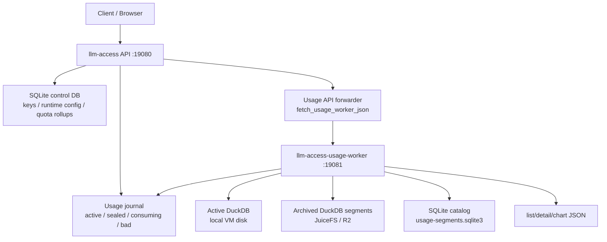

# LLM Access Tiered Usage Analytics 机制文档

> **Code Version**: 本文基于 `2026-05-09` 之后的 `llm-access` tiered
> DuckDB usage analytics 实现撰写，覆盖 archive schema 兼容和 catalog
> 预过滤优化之后的查询路径。
>
> **讨论范围**: 本文只讨论 `llm-access` usage event 的生产、journal、
> worker 消费、DuckDB segment 下沉、SQLite catalog 和基于 catalog 的查询加速。
> Codex/Kiro 协议转换、账号刷新、代理解析、前端视觉交互不在本文展开。
>
> **职责边界**: `llm-access` API 进程只承担请求服务、usage event 生产、
> 控制面必要 quota/rollup 更新和 worker API 转发。usage 明细查询、chart
> 聚合、archive 扫描和分页计算由 `llm-access-usage-worker` 负责。

## 1. 背景与目标

生产 `llm-access` 的 usage 数据有两个互相冲突的要求。

第一，写入路径必须足够轻。网关热路径在处理 Codex/Kiro 请求时会生成 usage
event，但不能因为明细分析库的 I/O 或扫描成本拖慢用户请求。

第二，查询路径必须覆盖完整历史。公开 usage 页面、admin usage 页面和 Kiro
排障都需要查最近热数据，也需要查已经归档到 JuiceFS/R2 后端的历史 DuckDB
segment。

直接用一个持续增长的 DuckDB 文件可以简化实现，但会把写入锁、WAL、归档、
大范围查询和历史 schema 演进都压在一个文件上。当前实现选择 tiered
storage：

```text
API producer
  -> local usage journal
  -> usage worker
  -> active DuckDB segment
  -> archived DuckDB segments
  -> SQLite segment catalog
```

这套设计的目标是：

- 保持 API 热路径只生产 usage event，不直接做历史 usage 查询。
- 让当前写入只命中本地 active DuckDB segment。
- 把已经封存的 segment 变成 immutable archive，适合放在 JuiceFS/R2。
- 用轻量 SQLite catalog 描述 archive 元数据，避免查询时盲目打开所有 archive。
- 对旧 archive schema 保持可读，避免新增列后历史查询失败。

非目标也很明确：

- 不把 SQLite catalog 变成 usage 明细库。
- 不用 catalog 替代 DuckDB 对当前页明细的精确读取。
- 不让 API 进程承担 list/detail/chart 的 analytics 计算。

## 2. 模型与术语

| 术语 | 含义 | 存储介质 |
|---|---|---|
| Usage Event | 一次网关请求的明细事实，包括 key、provider、model、token、credit、状态码和诊断字段 | journal block、DuckDB `usage_events` |
| Usage Journal | API producer 写出的本地追加日志，worker 从 sealed 文件消费 | 文件目录 |
| Active Segment | 当前可写 DuckDB 文件，worker 把 journal event 导入这里 | DuckDB |
| Pending Segment | active rollover 后等待下沉的 DuckDB 文件 | DuckDB 文件 |
| Compacting Segment | 下沉前本地 compact 产生的临时 DuckDB 文件 | DuckDB 文件 |
| Archive Segment | 下沉完成后的 immutable DuckDB 文件 | DuckDB |
| Segment Catalog | archive 的轻量索引和摘要，不存请求体明细 | SQLite |
| `usage_segments` | 每个 archive segment 一行的目录表 | SQLite |
| `usage_segment_key_rollups` | 每个 segment/key/provider 一行的倒排摘要 | SQLite |
| `usage_segment_events` | event_id 到 segment_id 的定位表 | SQLite |

核心不变量：

- `usage_events` 明细的 source of truth 是 DuckDB，不是 SQLite catalog。
- `usage_segment_key_rollups` 只保存聚合摘要，不保存请求正文、响应正文或 headers。
- archive segment 一旦发布就是 immutable；后续 catalog 可以重建或覆盖发布，但 archive 文件本身不在查询时修改。
- `source=hot` 只读 active segment，`source=archive` 只读 archived segments，`source=all` 同时读两者。
- `start_ms` 是闭区间下界，`end_ms` 是开区间上界。

## 3. 端到端架构

### 3.1 职责分层



`llm-access` API 进程仍然会做控制面必要工作，例如 key 鉴权、quota rollup
更新、pending rollup overlay 和 journal 生产。这些是请求接入的控制面职责。
但 usage 查询相关的 list/detail/chart、archive 选择、count、分页和 chart
bucket 计算都走 worker。

API 公开 usage 页面请求的实际路径是：

```text
/api/llm-gateway/public-usage/query
  -> llm-access API 校验 query key / secret
  -> API 读取 usage_query_base_url
  -> API 转发到 worker /admin/llm-gateway/usage
  -> worker 查询 DuckDB/catalog
  -> API 返回裁剪后的 public response
```

### 3.2 存储分层

```text
state root: /mnt/llm-access
├── control/llm-access.sqlite3
├── usage-journal/
│   ├── active/
│   ├── sealed/
│   ├── consuming/
│   └── bad/
└── analytics/
    ├── segments/
    │   └── usage-<sealed_ms>-<seq>.duckdb
    └── catalog/
        └── usage-segments.sqlite3

local VM disk:
└── /var/lib/staticflow/llm-access/analytics-active/
    ├── usage-active-000000000123.duckdb
    ├── pending/
    └── compacting/
```

生产配置里 active segment 放在 VM 本地盘，archive 和 catalog 放在
`/mnt/llm-access/analytics`。这样写入热路径优先使用本地块存储，历史数据
可以随 JuiceFS/R2 做容量扩展。

### 3.3 数据形态变化

```text
UsageEvent struct
  |
  v
Journal block
  |
  v
UsageEventRow
  |
  v
active DuckDB usage_events
  |
  v
pending DuckDB segment
  |
  v
compacted DuckDB archive
  |
  +--> SQLite usage_segments
  +--> SQLite usage_segment_key_rollups
  +--> SQLite usage_segment_events
```

DuckDB 保存明细事实和按小时/天的 rollup 表；SQLite catalog 保存 segment
层面的目录、key/provider 摘要和 event locator。查询时先用 catalog 缩小候选
archive，再按需要打开 DuckDB。

## 4. 写入路径与 producer 边界

### 4.1 API 热路径的 usage event 生产

provider runtime 生成 `UsageEvent` 后，写入 `UsageAccounting`。`UsageAccounting`
先把事件放进内存 pending rollup，用于避免控制面读到明显滞后的 key 用量；
然后通过后台 flusher 批量落盘。

后台 flusher 的顺序是：

```text
batch usage events
  |
  +-- persist control-plane rollups
  |
  +-- append same events to analytics sink
        |
        v
      JournalUsageEventSink
```

在当前 standalone `llm-access` API 进程里，analytics sink 是 journal sink，
不是 DuckDB repository。也就是说 API 不直接写 tiered DuckDB analytics；它只把
usage event 写成 journal 文件，供 worker 消费。

### 4.2 Journal 文件的封口规则

API producer 写 `usage-journal/active`，满足任一条件时 seal 当前文件：

- 当前 active journal 文件超过 `usage_journal_max_file_bytes`。
- 当前 active journal 文件年龄超过 `usage_journal_max_file_age_ms`。

seal 后文件进入 `usage-journal/sealed`，worker 再把它 claim 到
`usage-journal/consuming`。如果 producer 异常退出，启动时会先恢复 orphan
active 文件，避免半封口文件丢失。

### 4.3 Worker 消费 journal

usage worker 运行两个职责：

```text
HTTP query server
  /admin/llm-gateway/usage
  /admin/kiro-gateway/usage
  /admin/llm-access/usage/chart
  /admin/llm-access/usage-worker/status

background importer
  sealed journal -> consuming journal -> active DuckDB
```

worker 按 sequence 选择最老的 sealed journal，rename 到 consuming，读取
blocks，解码 usage events，再调用 DuckDB repository 的 `append_usage_events_owned`。
成功后更新 consumer state；异常时状态会记录错误，文件留在可恢复目录。

## 5. Segment 生命周期

### 5.1 Active segment 选择

tiered repository 启动时会：

1. 创建 active、pending、compacting、archive、catalog 目录。
2. 初始化 SQLite catalog。
3. 扫描 pending 目录，恢复上次未完成的 segment sealer。
4. 在 active 目录里选择最新 `usage-active-*.duckdb`。
5. 如果没有 active 文件，用 catalog 里的最新 segment sequence 推导下一个 active sequence。

这保证了进程重启后不会从 `000000000001` 重新开始，也不会忘记已经封存的
sequence。

### 5.2 Active segment 写入与 rollover

worker 导入 usage events 时只写 active segment。写入前后都会检查磁盘大小：

```text
active .duckdb size + active .duckdb.wal size >= rollover_bytes
```

如果超过阈值：

```text
CHECKPOINT active DuckDB
  |
  v
rename active -> active/pending/usage-<now_ms>-<seq>.duckdb
  |
  v
create new usage-active-<next_seq>.duckdb
  |
  v
spawn segment sealer thread
```

这里把 WAL 也计入阈值是必要的。DuckDB 主文件大小可能暂时不变，但 WAL
仍然在增长；只看 `.duckdb` 主文件会误判 active segment 没有增长。

### 5.3 Pending segment 下沉

sealer 线程串行执行，避免多个 archive 发布同时抢资源。每个 pending segment
最多重试 5 次。下沉过程是：

```text
pending DuckDB
  |
  v
ATTACH pending as read-only
  |
  v
copy usage_events / details / hourly rollups / daily rollups
  |
  v
CHECKPOINT compacted temp DuckDB
  |
  v
validate compacted stats == source stats
  |
  v
copy compacted -> archive_dir/*.uploading.duckdb
  |
  v
rename uploading -> archive_dir/*.duckdb
  |
  v
publish SQLite catalog
  |
  v
delete pending and compacting temp files
```

`*.uploading.duckdb` 是发布过程的中间态。只有 rename 成正式
`*.duckdb` 后，archive 才被 catalog 指向。

### 5.4 Catalog 发布

archive 文件发布成功后，sealer 会重新打开 archive DuckDB，生成 `SegmentStats`：

```text
segment-level stats
  row_count
  event_id_count
  min(created_at_ms)
  max(created_at_ms)

key/provider rollups
  key_id
  provider_type
  row_count
  token totals
  credit total
  credit_missing_events
  max(created_at_ms)
```

然后在一个 SQLite transaction 里写入三类 catalog 行：

```text
usage_segments
  one row per archive segment

usage_segment_key_rollups
  one row per segment + key_id + provider_type

usage_segment_events
  one row per event_id
```

如果某个 segment 已经有旧 catalog 行，发布前会先删除该 segment 的旧
event locator 和 key rollup，再插入新结果。这样 catalog 发布是可重试的。

## 6. Catalog Schema

### 6.1 `usage_segments`

`usage_segments` 是 archive segment 的目录表。

| 字段 | 含义 | 查询用途 |
|---|---|---|
| `segment_id` | segment 主键，例如 `usage-<sealed_ms>-<seq>` | join 和 sequence 推导 |
| `archive_path` | immutable DuckDB archive 文件路径 | 需要读取明细时打开 |
| `state` | 当前只允许 `archived` | 状态过滤 |
| `start_ms` | segment 内最早 `created_at_ms` | 时间窗口剪枝 |
| `end_ms` | segment 内最晚 `created_at_ms` | 时间窗口剪枝 |
| `row_count` | segment 总 usage event 数 | 无过滤或完整覆盖时直接 count |
| `size_bytes` | archive 文件大小 | 运维观察 |
| `sealed_at_ms` | catalog 发布时刻 | sequence 和运维观察 |

索引：

```sql
CREATE INDEX idx_usage_segments_time
  ON usage_segments(end_ms, start_ms);
```

### 6.2 `usage_segment_key_rollups`

`usage_segment_key_rollups` 是 archive segment 的 key/provider 倒排摘要。

一行的粒度是：

```text
segment_id + key_id + provider_type
```

字段：

| 字段 | 含义 | 查询用途 |
|---|---|---|
| `segment_id` | 所属 archive segment | join `usage_segments` |
| `key_id` | gateway key ID | key 过滤 |
| `provider_type` | `kiro`、`codex` 等 provider | provider 过滤 |
| `row_count` | 该 segment 内该 key/provider 的事件数 | 匹配 count |
| `input_uncached_tokens` | 聚合 token | key 汇总 |
| `input_cached_tokens` | 聚合 token | key 汇总 |
| `output_tokens` | 聚合 token | key 汇总 |
| `billable_tokens` | 聚合 billable token | key 汇总 |
| `credit_total` | 聚合 credit，TEXT 存储 | key 汇总 |
| `credit_missing_events` | 缺失 credit 的事件数 | lower-bound 标记 |
| `last_used_at_ms` | 该 key/provider 在 segment 内最后使用时间 | key 汇总 |

主键和索引：

```sql
PRIMARY KEY (segment_id, key_id, provider_type)

CREATE INDEX idx_usage_segment_key_rollups_key
  ON usage_segment_key_rollups(key_id, provider_type);
```

这张表不存 request body、headers、response body 或单条事件诊断字段。它只回答：

```text
某个 archive segment 里是否有这个 key/provider
有多少行
聚合 token/credit 大概是多少
```

### 6.3 `usage_segment_events`

`usage_segment_events` 是 detail 查询的定位表。

| 字段 | 含义 |
|---|---|
| `event_id` | usage event ID |
| `segment_id` | 所属 archive segment |

detail 查询先查 active segment；如果 active 不命中，再通过
`usage_segment_events` 定位 archive path，然后只打开那一个 archive DuckDB。

## 7. 查询路径与 Catalog 加速

### 7.1 Query Contract

usage list 查询归一化成 `UsageEventQuery`：

```text
key_id: Option<String>
provider_type: Option<String>
source: hot | archive | all
start_ms: Option<i64>
end_ms: Option<i64>
limit: usize
offset: usize
```

worker 路由会把 `/admin/kiro-gateway/usage` 固定成 `provider_type=kiro`，
`/admin/llm-gateway/usage` 则不强制 provider。

默认 `source=hot`。公开 usage lookup 会显式请求 `source=all`，因为用户期望看到
完整历史。

### 7.2 `source=hot`

```text
open active DuckDB
  |
  +-- count matching rows
  |
  +-- fetch current page summaries
```

这个路径不访问 SQLite catalog，也不打开 archive。

### 7.3 `source=archive`

```text
query SQLite catalog
  |
  v
build archive partitions
  |
  v
plan page fetches
  |
  v
open only archive DuckDB files needed by the page
```

archive 查询先构造 partition 列表。每个 partition 包含：

```text
archive_path
matching count
partition kind = Archive
```

partition count 的来源取决于查询条件。

### 7.4 `source=all`

`source=all` 是 hot 和 archive 的合并：

```text
active partition
  count from active DuckDB

archive partitions
  count from SQLite catalog or partial DuckDB count

global newest-first partition list
  |
  v
page fetch plan
  |
  v
fetch only required segments
```

active partition 总是排在 archive partitions 前面，因为 active 是最新写入段；
archive catalog 按 `end_ms DESC, segment_id DESC` 排序。

### 7.5 无 key/provider 过滤的 archive 查询

没有 `key_id` 和 `provider_type` 时，catalog 查询只用 `usage_segments`：

```sql
SELECT archive_path, start_ms, end_ms, row_count
FROM usage_segments
WHERE state = 'archived'
  AND (?start IS NULL OR end_ms IS NULL OR end_ms >= ?start)
  AND (?end IS NULL OR start_ms IS NULL OR start_ms < ?end)
ORDER BY COALESCE(end_ms, 0) DESC, segment_id DESC
```

如果 segment 完全落在查询时间窗口内，`usage_segments.row_count` 就是精确 count，
不需要打开 archive DuckDB。只有 segment 与查询时间窗口部分重叠时，才打开该
archive 做精确 count。

### 7.6 带 key/provider 过滤的 archive 查询

带 `key_id` 或 `provider_type` 时，catalog 查询使用
`usage_segment_key_rollups`：

```sql
SELECT
  s.archive_path,
  s.start_ms,
  s.end_ms,
  s.row_count,
  COALESCE(sum(r.row_count), 0) AS matching_row_count
FROM usage_segments s
JOIN usage_segment_key_rollups r ON r.segment_id = s.segment_id
WHERE s.state = 'archived'
  AND (?start IS NULL OR s.end_ms IS NULL OR s.end_ms >= ?start)
  AND (?end IS NULL OR s.start_ms IS NULL OR s.start_ms < ?end)
  AND (?key_id IS NULL OR r.key_id = ?key_id)
  AND (?provider_type IS NULL OR r.provider_type = ?provider_type)
GROUP BY s.segment_id, s.archive_path, s.start_ms, s.end_ms, s.row_count
HAVING matching_row_count > 0
ORDER BY COALESCE(s.end_ms, 0) DESC, s.segment_id DESC
```

这一步是 key 查询加速的核心。它把旧路径：

```text
打开所有时间命中的 archive
  -> 在 DuckDB 里判断是否包含 key/provider
```

改成：

```text
先在 SQLite catalog 判断哪些 archive 包含 key/provider
  -> 只打开有匹配行的 archive
```

对单 key 查询，例如 `for-gaohancheng1`，如果 50 个 archive 里只有 3 个含有该
key，查询会只保留这 3 个 archive 进入后续 count/page 逻辑。

### 7.7 完整覆盖与部分覆盖

catalog 的 `row_count` 或 `matching_row_count` 只对完整 segment 精确。时间窗口
决定是否需要打开 DuckDB 精确 count。

完整覆盖：

```text
query window:    |----------------------------|
segment window:       |----------|

count = catalog count
不打开 archive DuckDB 做 count
```

部分覆盖：

```text
query window:          |----------------|
segment window: |-------------|

count = DuckDB precise count
需要打开这个 archive DuckDB
```

这个判断保证了 catalog 加速不牺牲时间范围过滤的正确性。

### 7.8 分页计划

拿到 active/archive partitions 的 count 后，worker 先生成 page fetch plan。

示例：

```text
newest
  active     count=3
  archive E  count=36
  archive C  count=17
oldest

request offset=0 limit=20
  -> fetch active 3 rows
  -> fetch archive E 17 rows
  -> do not open archive C for detail page fetch
```

`offset` 和 `limit` 被限制在在线查询上限内，避免一次请求读取过多明细。

### 7.9 Chart 查询

chart 查询以 `key_id` 为核心，也会先走 catalog 过滤 archive：

```text
active DuckDB
  -> add buckets

archive catalog with key_id
  -> find matching archive segments
  -> open only those archive DuckDB files
  -> add buckets
```

chart bucket 的计算仍由 DuckDB 完成，catalog 只负责缩小 archive 候选集。

### 7.10 Detail 查询

detail 查询不是按时间范围扫描 archive：

```text
query active DuckDB by event_id
  |
  +-- hit -> return
  |
  +-- miss
        |
        v
      SQLite usage_segment_events
        |
        v
      one archive path
        |
        v
      open that archive DuckDB by event_id
```

这避免了历史 detail 查询退化成逐个 archive 查找。

## 8. Schema 演进与旧 Archive 兼容

archive segment 是 immutable 的，历史 DuckDB 文件不会因为新版本新增列而自动
迁移。例如新版本 usage event 增加了 streaming 诊断字段：

```text
stream_completed_cleanly
downstream_disconnect
final_event_type
bytes_streamed
```

旧 archive 中没有这些列。如果查询 SQL 固定写：

```sql
SELECT stream_completed_cleanly FROM usage_events
```

旧 archive 会直接触发 DuckDB binder error。

当前实现改成 schema-aware SELECT：

```text
PRAGMA table_info('usage_events')
  |
  v
生成固定输出 contract
  |
  +-- 列存在：SELECT column
  +-- 列缺失：SELECT NULL/default AS column
```

因此 list/detail 的响应结构保持稳定，旧 archive 缺失的新字段返回 `null` 或
安全默认值。这是历史兼容机制，不是查询性能优化；它解决的是 `source=all`
扫到旧 archive 时的正确性问题。

## 9. API 与 Worker 的边界

### 9.1 API 的职责

API 进程负责：

- 处理 public/admin/gateway HTTP 请求。
- 鉴权 gateway key。
- 更新控制面 quota/rollup。
- 生产 usage journal。
- 公开 usage 页面时转发 worker 查询结果。

API 不负责：

- 直接扫描 archive DuckDB。
- 直接计算 usage list/detail/chart。
- 在 public usage path 内打开 tiered analytics storage。
- 为查询性能在 API 内维护额外缓存。

### 9.2 Worker 的职责

worker 负责：

- 消费 sealed usage journal。
- 写入 active DuckDB。
- 执行 segment rollover 和 archive 发布。
- 维护 SQLite segment catalog。
- 执行 usage list/detail/chart 查询。
- 暴露 worker status。

### 9.3 超时语义

API 转发 worker 查询时有 HTTP timeout。这个 timeout 只表达“API 最多等待
worker 多久”，不改变职责边界。提高 timeout 可以避免把慢查询误报成 worker
不可用，但真正的性能修复仍然必须发生在 worker/store 查询路径。

## 10. 设计取舍

| 方案 | 优点 | 缺点 | 当前结论 |
|---|---|---|---|
| 单 DuckDB 文件长期增长 | 实现简单，查询无需合并多个 segment | WAL/锁/文件膨胀/归档困难，历史 schema 演进风险集中 | 不适合当前生产形态 |
| 每次查询直接扫所有 archive | 实现直接，catalog 简单 | 单 key 查询会打开大量无关 archive，JuiceFS/R2 场景成本高 | 已避免 |
| SQLite catalog 保存完整明细 | 查询可能更快 | 重复事实存储，schema 容易漂移，SQLite 文件会变成新瓶颈 | 不采用 |
| SQLite catalog 保存 segment/key 摘要 | 便宜、稳定、足够剪枝 | 不能回答完整明细，部分时间窗口仍需 DuckDB count | 当前采用 |
| API 直接查 DuckDB | 少一次 HTTP 跳转 | 破坏 producer/API-only 边界，API 内存和 I/O 风险上升 | 不采用 |
| Worker 负责 analytics | 职责清晰，查询成本隔离 | 需要部署和监控 worker | 当前采用 |

当前设计优化的是：

- API 热路径稳定性。
- archive 查询的候选集剪枝。
- 历史 segment 的 immutable 存储。
- 按 key/provider 查询的在线响应时间。

它不解决：

- catalog 损坏后的自动重建。
- 大范围无过滤查询读取大量明细时的根本成本。
- DuckDB archive 文件本身位于远端存储时的首次打开延迟。
- 任意复杂 ad-hoc SQL 分析。

## 11. 运维排障手册

### 11.1 Public usage 页面返回 `usage worker is unavailable`

症状：

```text
/llm-access/usage 或 public usage query 返回 503
body: {"error":"usage worker is unavailable","code":503}
```

判断路径：

```text
API health
  |
  v
检查 runtime config usage_query_base_url
  |
  v
直接 curl worker 对应路径
  |
  +-- worker 不通：查 systemd / port / bind addr
  |
  +-- worker 通但慢：查 archive 查询路径和 catalog 过滤
```

关键点：这个错误来自 API 转发 worker 失败或超时，不等价于 worker 进程一定
宕机。

下一步：

- 查 `llm-access-usage-worker.service` 是否 active。
- 查 `/admin/llm-access/usage-worker/status`。
- 用同一 query 直连 worker，看 HTTP status 和耗时。
- 如果直连慢，检查是否缺少 key/provider catalog 剪枝。

### 11.2 `source=all` 查询报 DuckDB Binder Error

症状：

```text
Binder Error: Referenced column "stream_completed_cleanly" not found
```

判断路径：

```text
source=hot 是否正常
  |
  +-- 正常：active schema 没问题
  |
source=all 是否失败
  |
  +-- 失败：某个旧 archive schema 缺列
```

下一步：

- 确认 list/detail SQL 是否通过 `PRAGMA table_info('usage_events')` 生成。
- 确认缺失列是否使用 `NULL` 或默认值投影。
- 给旧 schema archive 增加回归测试，避免新列再次破坏历史查询。

### 11.3 单 key `source=all` 查询变慢

症状：

```text
key_id=某个 key
source=all
worker 直连可返回但耗时明显高
```

判断路径：

```text
查询是否带 key_id/provider_type
  |
  +-- 带过滤：应该 JOIN usage_segment_key_rollups
  |
  +-- 不带过滤：只使用 usage_segments
```

下一步：

- 检查 `usage-segments.sqlite3` 是否存在 `usage_segment_key_rollups`。
- 统计目标 key/provider 命中的 segment 数。
- 如果命中 segment 很少但 worker 仍打开大量 archive，说明查询没有走 catalog
  预过滤路径。
- 如果大量 segment 都命中该 key，慢是数据分布导致，不是预过滤失效。

### 11.4 Detail 查询慢或查不到历史事件

症状：

```text
/admin/.../usage/:event_id 在历史事件上慢或 404
```

判断路径：

```text
active DuckDB event_id lookup
  |
  +-- miss
        |
        v
      usage_segment_events lookup
        |
        +-- miss：catalog locator 缺失或 event_id 不存在
        |
        +-- hit：打开单个 archive 查询 detail
```

下一步：

- 在 catalog 中查 `usage_segment_events.event_id`。
- 如果 locator 缺失但 archive 里存在事件，需要重建该 segment catalog。
- 如果 locator 命中但 archive 打不开，检查 archive path、JuiceFS mount 和文件权限。

### 11.5 Active 文件大小看起来不增长

症状：

```text
usage-active-*.duckdb 主文件大小稳定
但 usage 仍在写入
```

判断路径：

```text
检查 .duckdb.wal
  |
  +-- WAL 增长：正常，尚未 checkpoint/rollover
  |
  +-- WAL 不增长：检查 journal worker 是否消费
```

下一步：

- 同时看 `.duckdb` 和 `.duckdb.wal`。
- 检查 rollover threshold。
- 检查 worker status 的消费进度。

## 12. 验证与测试策略

### 12.1 正确性测试

需要覆盖：

- 旧 archive schema 缺少新列时，list/detail 不报 binder error。
- 缺失的新字段以 `None`/默认值出现在响应 contract 中。
- 非匹配 archive 在部分时间窗口 count 前被 catalog 跳过。
- detail 查询通过 `usage_segment_events` 定位 archive。

### 12.2 性能验证

推荐的观察指标：

```text
direct worker query latency
public API forwarded query latency
archive candidate count from usage_segments
matched archive count from usage_segment_key_rollups
actually opened DuckDB archive count
```

如果单 key 查询的 matched archive count 远小于 candidate archive count，catalog
剪枝应该显著降低耗时。

### 12.3 部署验证

生产发布后至少验证：

```text
worker status endpoint returns 200
public usage query returns 200
direct worker query source=all returns 200
known historical key source=all returns expected total/events
old archive schema path does not raise Binder Error
```

## 13. 代码索引

### 13.1 API producer 与转发

| 子系统 | 文件 | 说明 |
|---|---|---|
| Runtime wiring | `llm-access/src/runtime.rs` | API 进程打开 journal sink，并把 analytics sink 指向 journal |
| Journal producer | `llm-access/src/usage_journal.rs` | API producer 写 active/sealed journal |
| Public usage forwarding | `llm-access/src/public.rs` | public usage 页面转发 worker 查询 |
| Query contract | `llm-access/src/usage_query.rs` | worker list/detail/chart HTTP contract |

### 13.2 Worker 与 tiered storage

| 子系统 | 文件 | 说明 |
|---|---|---|
| Worker binary | `llm-access/src/bin/llm-access-usage-worker.rs` | 打开 tiered DuckDB repository 并启动 HTTP/query/import loop |
| Worker runtime | `llm-access/src/usage_worker.rs` | journal consumer、worker status、query router |
| Tiered repository | `llm-access-store/src/duckdb.rs` | active/archive/catalog、rollover、查询规划 |
| Core trait | `llm-access-core/src/store.rs` | `UsageEventSink`、`UsageAnalyticsStore`、`UsageEventQuery` |

### 13.3 关键实现点

| 机制 | 入口 |
|---|---|
| tiered config | `TieredDuckDbUsageConfig` |
| catalog path | `tiered_catalog_path` |
| catalog schema | `initialize_tiered_catalog` |
| journal import into active | `append_usage_events_to_tiered` |
| active rollover | `rollover_active_segment` |
| pending publish | `publish_pending_segment` |
| segment stats | `collect_segment_stats` |
| catalog publish | `publish_segment_catalog` |
| archive partition planning | `archived_usage_partitions_for_query` |
| key/provider catalog filtering | `archived_segments_with_catalog_counts` |
| page fetch planning | `plan_tiered_usage_page_fetches` |
| detail locator | `locate_archived_segment` |
| schema-aware list/detail | `list_usage_event_summaries_sql`、`get_usage_event_detail_sql` |

## 14. 总结

这套 usage analytics 设计把“写入”和“查询”拆成两个进程边界：

```text
llm-access API
  producer / control-plane API / worker forwarder

llm-access-usage-worker
  journal consumer / DuckDB writer / archive sealer / usage query engine
```

segment 下沉把无限增长的 active DuckDB 拆成 immutable archive；SQLite catalog
把 archive 的时间范围、总行数、key/provider 倒排摘要和 event locator 提前写好。
查询时 worker 先用 catalog 选择候选 segment，再按完整覆盖、部分覆盖和分页需求
决定是否打开 DuckDB archive。

这个模型的关键价值不是“多一个 SQLite 表”，而是把昂贵的历史 DuckDB 文件打开
动作推迟到确实必要的时候。无过滤查询用 `usage_segments.row_count` 做 segment
级 count；带 key/provider 的查询用 `usage_segment_key_rollups` 跳过无关 archive；
detail 查询用 `usage_segment_events` 定位单个 archive。配合 schema-aware SELECT，
历史 archive 即使缺少新字段，也能继续被 `source=all` 查询安全读取。
