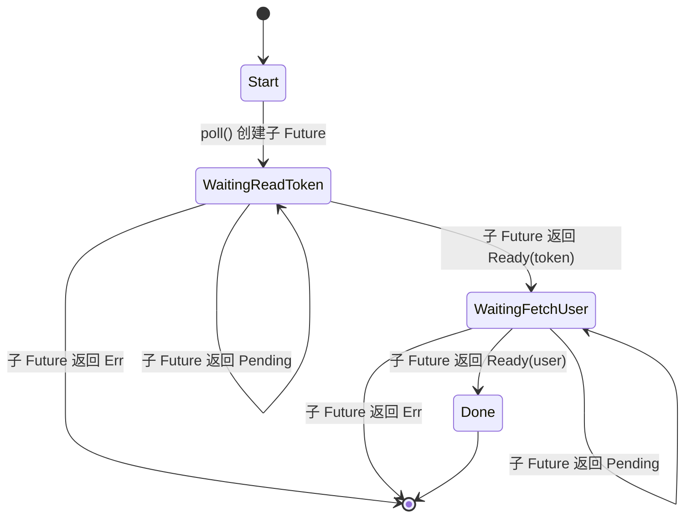
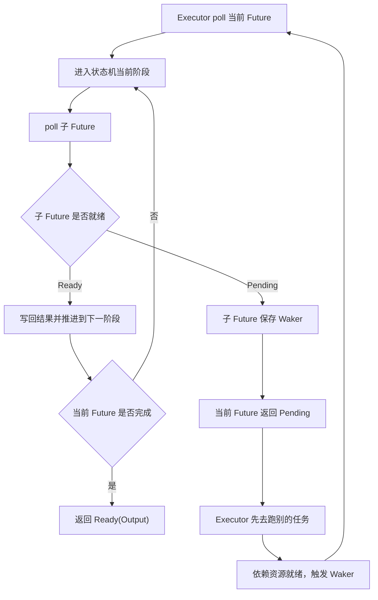
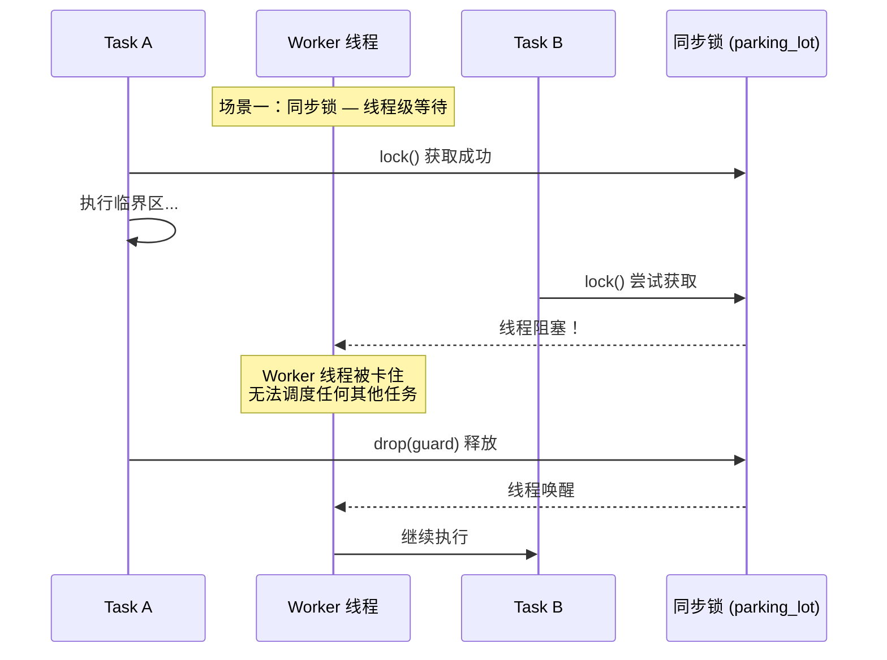
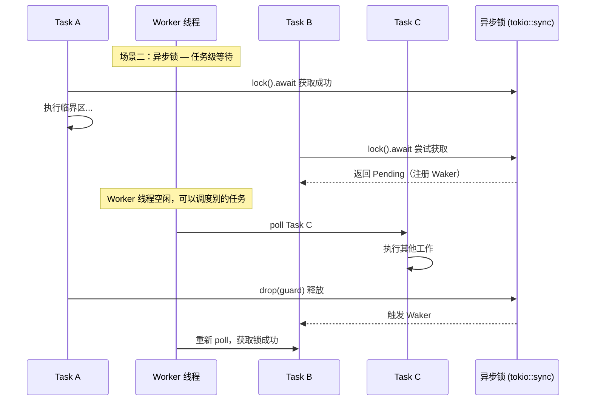
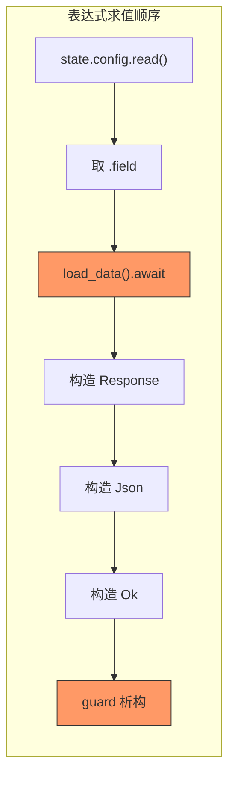
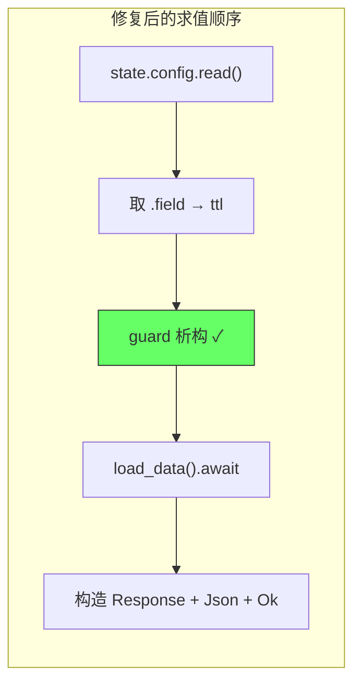
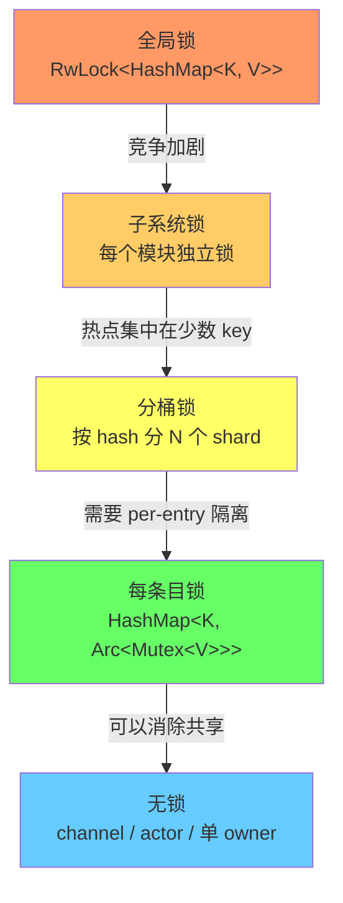
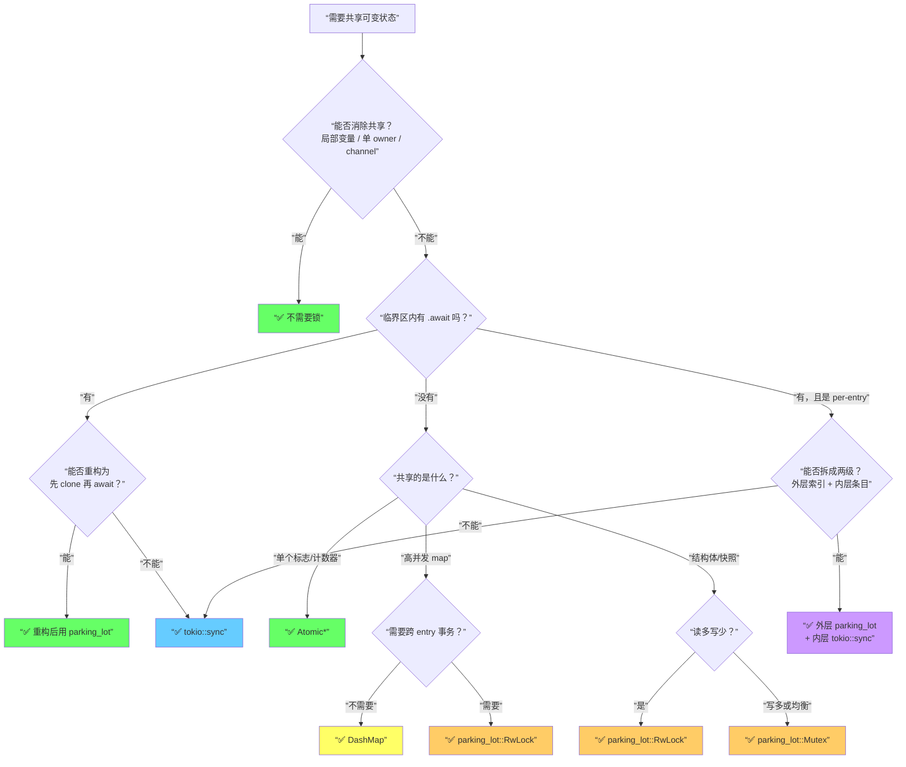

# Rust `await` 与锁选型深度说明：Future 状态机、`tokio::sync`、`parking_lot` 与粒度设计

> **Code Version**: 基于当前仓库工作树，时间点为 `2026-04-01`。  
> **讨论范围**: 本文解释 Rust `async`/`await` 在运行时到底发生了什么、为什么锁在 `await` 语义下会变成设计问题、`tokio::sync` 与 `parking_lot` 的实现特征与边界，以及在 StaticFlow backend 里如何做锁粒度选择。  
> **非目标**: 不展开 Tokio runtime 的全部调度实现，也不展开 CPU 缓存一致性和底层 OS futex 细节到源码级别。

## 1. 背景与目标

Rust 后端里“锁怎么选”这个问题，只有在同步程序里才比较简单。  
一旦进入 `async`/`await`，问题会立刻变成三层叠加：

1. `await` 会让执行流中断，但并不等于线程阻塞。
2. 锁的等待方式可能是“阻塞线程”，也可能是“挂起任务”。
3. 一把锁是否安全，不只取决于锁本身，还取决于它在多大粒度上保护数据、持有多久、是否穿过 `await`。

如果只记一句口诀，通常会变成一种危险的经验主义：

- “高性能锁就都换成 `parking_lot`”
- “async 场景就都用 `tokio::sync`”

这两句都不够准确。

真正需要理解的是：

- `await` 不是神秘语法糖，而是 Future 状态机的挂起点。
- 锁不是“快”或“慢”这么简单，而是“线程级等待”还是“任务级等待”。
- 锁选型的核心不是 crate 名字，而是临界区边界、共享状态模型和调度语义是否匹配。

本文的目标有四个：

1. 把 Rust `await` 的运行模型讲清楚，尤其是 `poll`、`Pending`、`Waker` 和状态机的关系。
2. 把“为什么同步锁跨 `await` 很危险”讲清楚，而不是停留在经验结论。
3. 把 `tokio::sync` 与 `parking_lot` 的设计特点、优势和限制拆开讲。
4. 给出一套实际可用的锁粒度选择方法，并用当前 StaticFlow backend 的真实例子验证。

## 2. 模型与术语

先统一几个术语。

| 术语 | 含义 | 关键点 |
|---|---|---|
| Future | Rust 异步计算的抽象对象 | 不是线程，不是协程栈，而是可被 `poll` 的状态机 |
| `poll` | executor 推动 Future 前进的一次尝试 | 返回 `Ready(T)` 或 `Pending` |
| `Waker` | Future 告诉 executor “我以后可以继续了”的回调句柄 | 用于在依赖就绪时重新调度任务 |
| `await` | 当前 Future 等待另一个 Future 完成的语法 | 编译后会拆成状态保存 + 子 Future `poll` |
| 任务挂起 | 当前 Future 返回 `Pending` | 不一定阻塞线程 |
| 同步锁 | `std::sync` / `parking_lot` 这一类锁 | 等不到锁时阻塞线程 |
| 异步锁 | `tokio::sync` 这一类锁 | 等不到锁时挂起任务，不阻塞 worker 线程 |
| 锁粒度 | 一把锁覆盖的数据范围和临界区范围 | 全局锁、分桶锁、每账号锁、每条目锁等 |
| 临界区 | 持锁执行的那段逻辑 | 越短越容易推理，也越不容易拖垮并发 |

本文后面会反复用到两个判断：

1. **这段代码持锁期间会不会发生 `await`**
2. **这段共享状态能不能进一步缩小到更小粒度**

这两个问题，比“这个 crate 性能好不好”更重要。

## 3. 端到端执行模型

### 3.1 `async fn` 到 Future 状态机的转换

Rust 的 `async fn` 编译后，不会变成一个真正拥有独立栈的协程。  
它会变成一个实现了 `Future` trait 的匿名状态机对象。

逻辑上可以把下面这段代码：

```rust
async fn load_user() -> Result<User> {
    let token = read_token().await?;
    let user = fetch_user(token).await?;
    Ok(user)
}
```

理解成一个”保存局部变量和当前阶段”的对象。编译器生成的状态机大致等价于：

```rust
enum LoadUserFuture {
    /// 初始状态：还没开始
    Start,
    /// 阶段一：正在等 read_token()
    WaitingReadToken {
        sub_future: ReadTokenFuture,
    },
    /// 阶段二：拿到 token，正在等 fetch_user(token)
    WaitingFetchUser {
        token: Token,                   // 跨 await 保留的局部变量
        sub_future: FetchUserFuture,
    },
    /// 结束状态
    Done,
}

impl Future for LoadUserFuture {
    type Output = Result<User>;

    fn poll(self: Pin<&mut Self>, cx: &mut Context<'_>) -> Poll<Result<User>> {
        loop {
            match self.state {
                Start => {
                    self.state = WaitingReadToken {
                        sub_future: read_token(),
                    };
                }
                WaitingReadToken { sub_future } => {
                    match sub_future.poll(cx) {
                        Poll::Ready(Ok(token)) => {
                            self.state = WaitingFetchUser {
                                token,
                                sub_future: fetch_user(token),
                            };
                        }
                        Poll::Ready(Err(e)) => return Poll::Ready(Err(e)),
                        Poll::Pending => return Poll::Pending, // ← 挂起点
                    }
                }
                WaitingFetchUser { sub_future, .. } => {
                    match sub_future.poll(cx) {
                        Poll::Ready(Ok(user)) => {
                            self.state = Done;
                            return Poll::Ready(Ok(user));
                        }
                        Poll::Ready(Err(e)) => return Poll::Ready(Err(e)),
                        Poll::Pending => return Poll::Pending, // ← 挂起点
                    }
                }
                Done => panic!(“polled after completion”),
            }
        }
    }
}
```

对应的状态转换图：



这个状态机内部会保存：

- 当前执行到了哪一步（`enum` 的 variant）
- 哪些局部变量需要跨 `await` 保留（如 `token` 字段）
- 当前正在等待的子 Future（如 `sub_future` 字段）

关键观察：每个 `await` 点对应一个 `Poll::Pending` 返回路径。在 `Pending` 时，整个状态机对象被保存在堆上，线程可以去做别的事。

因此，`await` 的本质不是”让线程睡一会儿”，而是：

1. 保存当前上下文到状态机字段
2. 去 `poll` 子 Future
3. 如果子 Future 没完成，就返回 `Pending`，线程立即可用
4. 等子 Future 通过 `Waker` 通知后，executor 重新 `poll`，从保存的状态恢复继续执行

### 3.2 `poll` 与 `Waker` 的协作路径

整体过程可以画成这样：



这里最重要的一点是：

- `Pending` 表示“这个任务现在先停一下”
- 它不等于“当前线程卡在这里”

这就是为什么 async 程序可以在少量线程上调度大量 I/O 任务。

### 3.3 `Pin` 与局部变量保留

Future 状态机里，跨 `await` 的局部变量会被放进状态机对象本身。  
一旦某个阶段内部引用了状态机自己的字段，就不能再随便移动这个 Future 的内存位置，所以 `poll` 的签名是：

```rust
fn poll(self: Pin<&mut Self>, cx: &mut Context<'_>) -> Poll<Output>
```

这里不需要把 `Pin` 神化，只要记住一点：

- **Future 在被 poll 期间，其内部状态需要地址稳定**

这和锁的关系在于：

- 如果某个 guard、引用或局部变量跨 `await` 被保存进状态机，它的生命周期也会被延长到下次恢复之前。

因此，很多“我明明已经只在一行里 `read()` 了一下，为什么还报错”的问题，本质上是 guard 被整个表达式生命周期拖长了。

## 4. `await` 对锁语义的改变

### 4.1 同步程序里的锁语义

在同步程序中，下面这种写法通常没有什么大问题：

```rust
let mut guard = cache.write();
guard.insert(key, value);
```

因为：

- 临界区很短
- 当前线程一直往下执行
- guard 的生命周期通常肉眼可见

### 4.2 异步程序里的生命周期延长

到了 async 里，问题就不是“能不能编译”，而是：

- guard 是否被保存进 Future 状态机
- guard 持有期间 executor 是否还能调度别的任务
- 别的任务抢同一把锁时，是任务挂起还是线程阻塞

下面这段代码是危险模式（抽象示例）：

```rust
let mut guard = my_lock.write();
let value = fetch_remote().await;   // ← 持锁跨 await
guard.insert(value);
```

如果 `my_lock` 是同步锁，那么持锁期间发生了两件坏事：

1. 当前任务已经在等远端 I/O，但锁还没释放。
2. 任何想拿同一把锁的任务都会阻塞 worker 线程，而不是仅仅挂起。

这时不是”这个任务慢一点”而已，而是整个 async runtime 的调度模型被破坏了。

下面用 StaticFlow 里的一个真实案例来说明。`track_music_play` 之前的写法：

```rust
// ❌ 危险：同步写锁跨 await
async fn track_music_play(state: &AppState, id: &str, fingerprint: &str) -> Result<Json<...>> {
    let config = state.music_runtime_config.read().clone();
    let now_ms = Utc::now().timestamp_millis();
    let window_ms = (config.play_dedupe_window_seconds.max(1) as i64) * 1_000;

    let mut guard = state.music_play_dedupe_guard.write(); // parking_lot 写锁
    let key = format!(“{id}:{fingerprint}”);
    if guard.get(&key).is_some_and(|last| now_ms - *last < window_ms) {
        return Ok(Json(/* cooldown response */));
    }
    guard.insert(key, now_ms);
    // guard 还活着！
    let result = state.music_store.track_play(id, fingerprint, ...).await; // ← 持锁 await
    Ok(Json(result?))
}
```

修复后的写法：

```rust
// ✅ 安全：锁在 await 前释放
async fn track_music_play(state: &AppState, id: &str, fingerprint: &str) -> Result<Json<...>> {
    let config = state.music_runtime_config.read().clone();
    let now_ms = Utc::now().timestamp_millis();

    // 临界区：只做判重和内存更新，不做任何 I/O
    let cooldown_hit = {
        let window_ms = (config.play_dedupe_window_seconds.max(1) as i64) * 1_000;
        let mut guard = state.music_play_dedupe_guard.write();
        let key = format!(“{id}:{fingerprint}”);
        let hit = guard.get(&key).is_some_and(|last| now_ms - *last < window_ms);
        if !hit {
            guard.insert(key, now_ms);
        }
        hit
    }; // ← guard 在这里离开作用域，锁已释放

    if cooldown_hit {
        return Ok(Json(/* cooldown response */));
    }
    // 现在可以安全 await，没有任何锁被持有
    let result = state.music_store.track_play(id, fingerprint, ...).await;
    Ok(Json(result?))
}
```

两种写法的执行时间线对比：

```mermaid
gantt
    title 危险模式：同步锁跨 await
    dateFormat X
    axisFormat %s

    section Worker 线程 1
    获取写锁           :a1, 0, 1
    判重 + 插入         :a2, 1, 2
    await track_play (I/O) :crit, a3, 2, 8
    释放写锁           :a4, 8, 9

    section Worker 线程 2 (被阻塞)
    尝试获取写锁        :crit, b1, 3, 8
    实际执行            :b2, 8, 10

    section Worker 线程 3 (被阻塞)
    尝试获取写锁        :crit, c1, 4, 8
    实际执行            :c2, 10, 12
```

```mermaid
gantt
    title 修复后：锁在 await 前释放
    dateFormat X
    axisFormat %s

    section Worker 线程 1
    获取写锁 + 判重 + 释放 :a1, 0, 1
    await track_play (I/O)  :a2, 1, 7

    section Worker 线程 2
    获取写锁 + 判重 + 释放 :b1, 1, 2
    await track_play (I/O)  :b2, 2, 8

    section Worker 线程 3
    获取写锁 + 判重 + 释放 :c1, 2, 3
    await track_play (I/O)  :c2, 3, 9
```





差异一目了然：修复前三个 worker 线程串行等待，修复后三个 I/O 操作并行执行。

### 4.3 线程级等待与任务级等待

这是全文最核心的区别。

| 等待类型 | 代表 | 抢不到锁时发生什么 | 对 executor 的影响 |
|---|---|---|---|
| 线程级等待 | `parking_lot`、`std::sync` | 当前线程被阻塞 | worker 线程不能去跑别的任务 |
| 任务级等待 | `tokio::sync` | 当前 Future 返回 `Pending` | 线程还能调度别的任务 |

用序列图来对比两种等待模型在同一场景下的行为差异：





关键区别：同步锁阻塞的是线程，整个 worker 停摆；异步锁挂起的是任务，线程立刻去服务其他任务。

因此，”可能跨 `await` 的地方保留 `tokio::sync`”的意思就是：

- 如果一段代码在持锁期间可能需要等待异步事件完成，那么锁的等待模型必须和 async runtime 匹配。

### 4.4 表达式生命周期带来的隐藏持锁

另一个容易踩坑的地方，不是显式 `let guard = ...;`，而是隐式持锁：

```rust
// ❌ 隐式持锁跨 await — 编译器可能报错，也可能静默延长 guard 生命周期
Ok(Json(Response {
    ttl: state.config.read().field,     // read() 返回的 guard 活到整个表达式结束
    data: load_data().await,            // ← guard 跨过了这个 await
}))
```

从人类视角看，好像只是取了个字段。
但从编译器视角看，`state.config.read()` 返回的 guard 可能活到整个表达式结束，也就是跨过了后面的 `.await`。

用状态机模型来理解为什么会这样：



guard 的生命周期从 A 一直延伸到 G，中间跨过了 C 处的 `.await`。在状态机里，guard 会被保存为跨 `await` 的局部变量。

这就是为什么有时候会出现这种错误：

- handler 不是 `Send`
- future cannot be sent between threads safely
- 某个 `parking_lot::RwLockReadGuard` 被捕获到 async future 里

正确写法是显式拆开，让 guard 在 `await` 前析构：

```rust
// ✅ 显式拆开：guard 在 await 前离开作用域
let ttl = state.config.read().field;    // guard 在这行末尾析构
let data = load_data().await;           // 没有任何锁被持有
Ok(Json(Response { ttl, data }))
```



## 5. 锁粒度设计

### 5.1 粒度比锁类型更重要

很多并发问题并不是“锁太慢”，而是“锁太大”。

典型错误路径是：

- 先上一个全局大锁
- 为了省事把整个共享状态都塞进去
- 后面越来越多逻辑都在这把锁里做
- 最后不管用 `tokio::sync` 还是 `parking_lot` 都开始难受

更合理的顺序应该是：

1. 先问共享状态能不能不共享
2. 不能的话，问能不能拆成更小粒度
3. 再决定每个粒度用什么锁

### 5.2 常见粒度层次

| 粒度 | 例子 | 优点 | 风险 |
|---|---|---|---|
| 全局锁 | 整个账号池、一整份缓存 | 实现最简单 | 热点集中，锁竞争严重 |
| 子系统锁 | 一个模块的配置或状态快照 | 推理仍较容易 | 仍可能放大热点 |
| 分桶锁 | 按 key、按 provider、按 shard 划分 | 可并行度更高 | 管理更复杂 |
| 每条目锁 | 每个账号、每个连接、每个租约一把锁 | 最适合热点隔离 | 需要额外索引层 |
| 无锁/单线程所有权 | actor、channel、专属 worker | 避免共享可变状态 | 延迟模型与代码结构不同 |

粒度从粗到细的演进路径：



每一级的核心权衡是：锁粒度越细，并发度越高，但管理复杂度也越高。选择哪一级取决于实际的竞争模式，而不是理论上的"越细越好"。

### 5.3 StaticFlow 里的典型例子：AccountPool 两级锁

`AccountPool`（`crates/backend/src/llm_gateway/accounts.rs`）采用”外层索引 + 内层条目锁”的模式。先看结构定义：

```rust
// crates/backend/src/llm_gateway/accounts.rs
pub(crate) struct AccountPool {
    // 外层：parking_lot::RwLock 保护索引结构
    accounts: RwLock<HashMap<String, Arc<AsyncRwLock<CodexAccount>>>>,
    rate_limits: RwLock<HashMap<String, AccountRateLimitSnapshot>>,
    usage_refresh_health: RwLock<HashMap<String, AccountUsageRefreshHealth>>,
    last_routed_at_ms: RwLock<HashMap<String, i64>>,
    auth_file_mtimes: RwLock<HashMap<String, Option<SystemTime>>>,
    // ...
}
```

架构图：

```mermaid
flowchart TD
    subgraph “AccountPool”
        subgraph “外层索引 (parking_lot::RwLock)”
            IDX[“HashMap&lt;name, Arc&lt;AsyncRwLock&lt;CodexAccount&gt;&gt;&gt;”]
            RL[“rate_limits: HashMap&lt;name, Snapshot&gt;”]
            LR[“last_routed_at_ms: HashMap&lt;name, i64&gt;”]
        end

        subgraph “内层条目 (tokio::sync::RwLock)”
            A1[“Account A<br/>access_token, refresh_token, status”]
            A2[“Account B<br/>access_token, refresh_token, status”]
            A3[“Account C<br/>access_token, refresh_token, status”]
        end

        IDX -->|”Arc clone”| A1
        IDX -->|”Arc clone”| A2
        IDX -->|”Arc clone”| A3
    end

    R1[“请求 1: 选账号”] -->|”1. read() 外层索引”| IDX
    R1 -->|”2. read().await 内层条目”| A1
    R2[“请求 2: 刷新 token”] -->|”1. read() 外层索引”| IDX
    R2 -->|”2. write().await 内层条目”| A2

    style IDX fill:#fc6
    style A1 fill:#6cf
    style A2 fill:#6cf
    style A3 fill:#6cf
```

实际使用模式——选择最佳账号：

```rust
// crates/backend/src/llm_gateway/accounts.rs — select_best_account
pub async fn select_best_account(&self, ...) -> Option<(String, CodexAuthSnapshot, bool)> {
    // 第一步：同步读外层索引，clone Arc 引用后立即释放锁
    let account_entries = self
        .accounts
        .read()                          // parking_lot 读锁
        .iter()
        .map(|(name, entry)| (name.clone(), entry.clone()))
        .collect::<Vec<_>>();            // 锁在这行末尾释放
    let rate_limits = self.rate_limits.read().clone();
    let last_routed = self.last_routed_at_ms.read().clone();

    // 第二步：逐个 await 内层条目锁，外层锁已释放
    let mut candidates = Vec::new();
    for (name, entry) in account_entries {
        let account = entry.read().await;  // tokio::sync 异步读锁
        if account.status != AccountStatus::Active {
            continue;
        }
        // ... 收集候选账号
    }
    // ... 选择最佳
}
```

这种设计比”一把大锁包住整个账号池并在里面做所有事”更合理，原因是：

1. 查找账号名是纯内存短路径，适合同步锁。外层 `parking_lot::RwLock` 持锁时间 < 1μs。
2. 单个账号刷新 token 或读取快照时可能跨 `await`（网络 I/O），需要 async 锁。
3. 外层索引锁先释放，再进入内层账号锁，避免锁顺序放大。
4. 不同账号的操作完全并行——Account A 在刷新 token 时，Account B 的读取不受影响。

同样的两级模式也出现在 Kiro gateway 的 per-account refresh lock（`crates/backend/src/kiro_gateway/runtime.rs`）：

```rust
// crates/backend/src/kiro_gateway/runtime.rs — KiroTokenManager
pub struct KiroTokenManager {
    refresh_locks: RwLock<HashMap<String, Arc<Mutex<()>>>>,  // 外层 parking_lot
    // ...
}

// 获取 per-account 的 async mutex
async fn refresh_lock_for_account(&self, account_name: &str) -> Arc<Mutex<()>> {
    // 先尝试同步读
    if let Some(lock) = self.refresh_locks.read().get(account_name).cloned() {
        return lock;
    }
    // 不存在则同步写入新锁
    let mut refresh_locks = self.refresh_locks.write();
    refresh_locks
        .entry(account_name.to_string())
        .or_insert_with(|| Arc::new(Mutex::new(())))  // tokio::sync::Mutex
        .clone()
}

// 使用：per-account 串行刷新
pub async fn ensure_context_for_account(&self, account_name: &str, ...) -> Result<CallContext> {
    let refresh_lock = self.refresh_lock_for_account(account_name).await;
    let _guard = refresh_lock.lock().await;  // 只锁当前账号，其他账号不受影响
    // ... 刷新 token，可能多次 await 网络 I/O
}
```

## 6. `parking_lot` 的设计特点

### 6.1 设计目标

`parking_lot` 的目标不是“支持 async”，而是：

- 用更低的 uncontended 开销实现同步锁
- 在锁竞争较轻或临界区较短时更高效
- 提供比标准库更精简、更一致的锁语义

### 6.2 实现特征

从工程视角看，可以把它理解成：

- 快路径尽量走用户态
- 竞争时用 parking/unparking 机制挂起和唤醒线程
- 有自旋和停车的混合策略
- 不做 `std::sync::Mutex` 那种 poisoning 语义

这带来几个结果：

| 特征 | `parking_lot` 的表现 | 工程意义 |
|---|---|---|
| 无竞争快路径 | 很短 | 适合热点内存状态 |
| 锁对象体积 | 较小 | 容易放到大量结构里 |
| 中毒策略 | 默认不 poisoning | panic 后不会强制整把锁失效 |
| 等待单位 | 线程 | 与 async runtime 不直接匹配 |

### 6.3 优势边界

`parking_lot` 最适合下面这些场景：

- 运行时配置读写
- 只在内存里做短时更新的缓存
- 快照表、索引表、client cache
- GeoIP reader 这类初始化后主要读的对象
- 不需要跨 `await` 的判重/限流表

StaticFlow backend 里这类对象包括：

- runtime config
- public submit guard
- upstream proxy snapshot
- reqwest client cache
- GeoIP reader cache

下面是几个典型的 `parking_lot` 使用模式：

**模式一：纯内存限流表**（`crates/backend/src/public_submit_guard.rs`）

```rust
// 类型定义：parking_lot::RwLock 包裹 HashMap
pub(crate) type PublicSubmitGuard = RwLock<HashMap<String, i64>>;

pub(crate) fn enforce_public_submit_rate_limit(
    guard: &PublicSubmitGuard,
    rate_limit_key: &str,
    now_ms: i64,
    rate_limit_seconds: u64,
    action_label: &str,
) -> Result<(), (StatusCode, Json<ErrorResponse>)> {
    let window_ms = (rate_limit_seconds.max(1) as i64) * 1_000;
    let mut writer = guard.write();  // 同步写锁
    if let Some(last) = writer.get(rate_limit_key) {
        if now_ms.saturating_sub(*last) < window_ms {
            return Err(/* rate limit exceeded */);
        }
    }
    writer.insert(rate_limit_key.to_string(), now_ms);
    writer.retain(|_, value| *value >= now_ms - window_ms * 6);  // 顺手清理过期条目
    Ok(())
    // writer 在这里析构，整个临界区 < 1μs
}
```

这是 `parking_lot` 的理想场景：纯内存 HashMap 操作，临界区极短，没有任何 I/O。

**模式二：Double-check 客户端缓存**（`crates/backend/src/upstream_proxy.rs`）

```rust
pub async fn client_for_selection(&self, ...) -> Result<(reqwest::Client, ResolvedUpstreamProxy)> {
    let resolved = self.resolve_proxy_for_selection(provider_type, selection).await?;
    let cache_key = ClientCacheKey::new(&resolved, profile);

    // 快路径：读锁检查缓存
    if let Some(client) = self.clients.read().get(&cache_key).cloned() {
        return Ok((client, resolved));
    }

    // 慢路径：写锁创建新客户端
    let mut clients = self.clients.write();
    // Double-check：可能在等写锁期间已被其他线程创建
    if let Some(client) = clients.get(&cache_key).cloned() {
        return Ok((client, resolved));
    }
    let client = apply_resolved_proxy(profile.client_builder(), &resolved)?
        .build()
        .context("failed to build cached upstream reqwest client")?;
    clients.insert(cache_key, client.clone());
    Ok((client, resolved))
}
```

注意 `resolve_proxy_for_selection().await` 在获取锁之前完成——所有 I/O 在锁外，锁内只做 HashMap 查找和插入。

**模式三：Lazy 初始化 + 读多写少**（`crates/backend/src/geoip.rs`）

```rust
async fn ensure_reader(&self) -> Result<()> {
    // 读锁检查：大多数请求走这条快路径
    {
        if self.inner.reader.read().is_some() {
            return Ok(());
        }
    } // 读锁释放

    // 只有首次调用才走到这里
    self.ensure_db_file().await?;                    // I/O 在锁外
    let data = tokio::fs::read(&self.inner.db_path).await?;  // I/O 在锁外
    let reader = Reader::from_source(data)?;

    *self.inner.reader.write() = Some(reader);       // 写锁只做赋值
    Ok(())
}

async fn lookup_local_region(&self, ip: IpAddr) -> Result<Option<GeoRegion>> {
    self.ensure_reader().await?;
    let reader_guard = self.inner.reader.read();     // 读锁
    let Some(reader) = reader_guard.as_ref() else { return Ok(None) };
    let city: geoip2::City<'_> = reader.lookup(ip)?.decode()?;
    Ok(build_region_from_city(city))
    // reader_guard 在这里析构，临界区只有 CPU 计算
}
```

GeoIP 查找是纯 CPU 操作，初始化后几乎全是读锁，`parking_lot::RwLock` 的读者并发性能在这里发挥到极致。

### 6.4 失败边界

`parking_lot` 不适合下面这些场景：

- 持锁期间可能发生网络 I/O
- 持锁期间可能等磁盘 I/O
- 持锁期间会 `await`
- 锁争用发生在 Tokio worker 线程热路径上，且等待时间不可控

这不是它“不好”，而是它本来就不是为 async task waiting 设计的。

## 7. `tokio::sync` 的设计特点

### 7.1 设计目标

`tokio::sync` 的目标是：

- 在 async runtime 中提供不会阻塞 worker 线程的同步原语
- 让“等待锁”表现成 Future 的 `Pending`
- 让任务调度和共享状态协调发生在同一个异步模型里

### 7.2 运行方式

高层理解即可：

- 抢不到锁时，不阻塞线程
- 当前任务注册到等待队列
- 返回 `Pending`
- 锁释放时唤醒等待任务，再由 executor 重新 poll

这意味着 `tokio::sync` 的等待成本通常比同步锁更高，但它换来的是：

- 不把 worker 线程卡死
- 更符合 I/O 密集型 async 服务的执行模型

### 7.3 `Mutex` 与 `RwLock` 的适用点

在 async 程序里，`tokio::sync::Mutex` 往往比 `RwLock` 更容易推理。  
只有在“读远多于写，而且读临界区本身也不大”时，`RwLock` 才值得上。

常见选择：

| 原语 | 适用情况 | 风险 |
|---|---|---|
| `tokio::sync::Mutex` | 单对象串行刷新、状态机推进、写多读少 | 容易形成串行瓶颈 |
| `tokio::sync::RwLock` | 读多写少，且确实可能跨 `await` | 结构一旦变大，读写关系会难推理 |

### 7.4 优势边界

`tokio::sync` 最适合：

- 每账号 token refresh 串行锁
- 需要跨 `await` 的共享状态
- 单条目生命周期与异步 I/O 强绑定的对象
- 文件热加载缓存、网络认证上下文、逐项刷新任务

StaticFlow backend 里仍保留 async 锁的典型对象包括：

- Codex 账号条目 inner lock
- Kiro 每账号 refresh 串行锁
- `CodexAuthSource` 的热加载缓存

下面是两个典型的 `tokio::sync` 使用模式：

**模式一：Per-entry 异步读写锁**（`crates/backend/src/llm_gateway/token_refresh.rs`）

```rust
// 每个账号条目用 tokio::sync::RwLock 保护
async fn refresh_and_poll_single_account(
    entry: &Arc<tokio::sync::RwLock<CodexAccount>>,
    // ...
) -> Result<CodexAuthSnapshot> {
    // 异步读锁：检查是否需要刷新
    let (status, needs_refresh) = {
        let account = entry.read().await;       // tokio::sync 异步读锁
        (account.status, token_needs_refresh(&account.access_token, now))
    }; // 读锁释放

    if needs_refresh {
        // 刷新 token 涉及网络 I/O
        refresh_account_token(entry, proxy_registry).await?;
        // refresh_account_token 内部：
        //   1. read().await 取 refresh_token
        //   2. HTTP POST 刷新（锁外）
        //   3. write().await 写回新 token
    }

    // 异步读锁：取最终快照
    let snapshot = {
        let account = entry.read().await;       // tokio::sync 异步读锁
        account.to_auth_snapshot()
    };
    Ok(snapshot)
}
```

这里必须用 `tokio::sync::RwLock` 而不是 `parking_lot::RwLock`，因为 `refresh_account_token` 内部会在持有写锁期间执行网络请求。如果用同步锁，刷新一个账号的 token 就会阻塞整个 worker 线程。

**模式二：Per-account 串行化 Mutex**（`crates/backend/src/kiro_gateway/runtime.rs`）

```rust
pub async fn ensure_context_for_account(
    &self,
    account_name: &str,
    force_refresh: bool,
) -> Result<CallContext> {
    // 快路径：不需要刷新时直接返回
    let auth = self.auth_by_name(account_name).await?;
    if !force_refresh && !needs_refresh(&auth) {
        return Ok(CallContext { auth, token: auth.access_token.clone()? });
    }

    // 慢路径：获取 per-account 的 async mutex
    let refresh_lock = self.refresh_lock_for_account(account_name).await;
    let _guard = refresh_lock.lock().await;  // tokio::sync::Mutex

    // Double-check：可能在等锁期间已被其他任务刷新
    let latest = self.auth_by_name(account_name).await?;
    if !force_refresh && !needs_refresh(&latest) {
        return Ok(CallContext { auth: latest, token: latest.access_token.clone()? });
    }

    // 真正执行刷新（网络 I/O）
    let refreshed = refresh_auth(self.upstream_proxy_registry.as_ref(), &latest).await?;
    self.persist_refreshed_auth(&refreshed).await?;
    // _guard 在函数返回时释放
    Ok(CallContext { auth: refreshed, token: refreshed.access_token.clone()? })
}
```

这个 `tokio::sync::Mutex` 的作用是：同一个账号的多个并发刷新请求只有一个真正执行网络 I/O，其他的等待后发现已刷新直接返回。不同账号之间完全并行。

## 8. `parking_lot` 与 `tokio::sync` 的对照

### 8.1 设计对照表

| 维度 | `parking_lot` | `tokio::sync` |
|---|---|---|
| 等待模型 | 阻塞线程 | 挂起任务 |
| 最佳场景 | 短临界区、纯内存、无 `await` | 可能跨 `await` 的共享状态 |
| 热路径性能 | 通常更好 | 通常更重 |
| executor 友好性 | 差 | 好 |
| 误用后果 | 容易把 worker 线程卡住 | 更容易出现逻辑串行化，但不容易卡死线程 |
| 推荐心智模型 | “CPU 上快速保护共享内存” | “让共享状态服从 async 调度” |

### 8.2 边界判断表

| 问题 | 如果答案是“是” | 推荐 |
|---|---|---|
| 持锁期间会不会 `await` | 会 | `tokio::sync` 或重构 |
| 临界区是不是纯内存且很短 | 是 | `parking_lot` |
| 只是读取一个运行时配置快照 | 是 | `parking_lot::RwLock` |
| 需要按账号逐个串行 refresh | 是 | 外层索引 `parking_lot` + 内层 `tokio::sync` |
| 是否可以先 clone snapshot 再异步处理 | 可以 | 优先这样做，减少 async 锁持有时间 |

## 9. 其他共享状态原语

锁不是唯一答案。

### 9.1 `Atomic*`

如果共享的是一个计数器、标志位、状态码，原子类型通常比锁更合适。  
锁只在“需要组合更新多个字段”时才有必要。

### 9.2 `DashMap`

`DashMap` 适合高并发 map 热路径，但它不是“免思考容器”。  
如果你会在持有 map entry guard 时做复杂逻辑，同样会把问题藏起来。

### 9.3 channel / actor

如果某份状态天然需要串行处理，最干净的模型往往不是锁，而是：

- 一个 owner task
- 其他地方通过 channel 发消息

这样共享可变状态直接消失。  
代价是调用方式要变成消息驱动。

## 10. StaticFlow backend 中的实际选型

### 10.1 当前更适合 `parking_lot` 的对象

这类对象有共同特征：

- 数据在内存中
- 持锁只做读/写/替换
- 不需要跨 `await`

当前 backend 里包括：

- `AppState` 的运行时配置与列表缓存
- `PublicSubmitGuard`
- 音乐播放判重表和评论限流表
- `UpstreamProxyRegistry` 的 snapshot 与 client cache
- `GeoIpResolver` 的 reader cache
- Kiro cached status snapshot
- LLM Gateway 的公开 rate-limit 缓存和 usage rollup 表

这些对象的共同使用模式是"clone-and-release"：

```rust
// 模式：读锁 → clone → 释放 → 异步处理
// crates/backend/src/kiro_gateway/status_cache.rs
pub(crate) async fn refresh_cached_status(runtime: &Arc<KiroGatewayRuntimeState>) -> Result<()> {
    let checked_at = now_ms();
    let auths = runtime.token_manager.list_auths().await?;  // await 在锁外

    let previous = runtime.status_cache.read().clone();      // 读锁 + clone，立即释放

    let mut next = KiroStatusCacheSnapshot { /* ... */ };
    for auth in auths {
        // 逐个 await 网络请求，没有任何锁被持有
        match runtime.token_manager.fetch_usage_limits_for_account(&auth.name, false).await {
            Ok(usage) => { /* ... */ },
            Err(err) => { /* ... */ },
        }
    }

    *runtime.status_cache.write() = next;                    // 写锁只做赋值，立即释放
    Ok(())
}
```

```rust
// 模式：写锁 → 纯内存更新 → 释放
// crates/backend/src/llm_gateway/runtime.rs
pub(crate) async fn rebuild_usage_rollups(&self) -> Result<()> {
    let rows = self.store.aggregate_usage_rollups().await?;  // await 在锁外
    let rollups = rows.into_iter()
        .map(|row| (row.key_id.clone(), row))
        .collect::<HashMap<_, _>>();
    *self.usage_rollups.write() = rollups;                   // 写锁只做赋值
    Ok(())
}

pub(crate) async fn append_usage_event(&self, ...) -> Result<LlmGatewayKeyRecord> {
    self.usage_event_tx.send(event.clone()).await?;          // await 在锁外
    let updated = {
        let mut rollups = self.usage_rollups.write();        // 写锁
        let rollup = rollups.entry(event.key_id.clone())
            .or_insert_with(|| LlmGatewayKeyUsageRollupRecord::default());
        apply_event_to_rollup(rollup, event);
        apply_usage_rollup(base_key, Some(rollup))
    };                                                       // 写锁释放
    Ok(updated)
}
```

### 10.2 当前必须保留 async 锁的对象

这类对象的共同特征是：

- 单条目操作可能要访问文件、网络或其他异步依赖
- 持有期间任务可能真正挂起

包括：

- 每个 Codex 账号条目
- Kiro 每账号 refresh lock
- 文件热加载的 auth cache

### 10.3 当前已修复的一处真实风险

`track_music_play`（`crates/backend/src/handlers.rs`）之前的路径是：

1. 拿 `music_play_dedupe_guard` 写锁
2. 发现命中冷却窗口
3. 持锁直接 `await music_store.track_play(...)`

这不是理论问题，而是实打实的异步长持锁。
现在的做法改成了：

1. 只在锁里完成判重和内存更新时间
2. 释放锁
3. 再去做数据库/存储调用

完整的修复前后对比见第 4.2 节的 `track_music_play` 示例。

这就是”缩短临界区优先于换锁种类”的典型例子。

### 10.4 模式总结

下面这张图汇总了 StaticFlow backend 中所有锁对象的分类：

```mermaid
flowchart LR
    subgraph “parking_lot::RwLock（短临界区，纯内存）”
        direction TB
        P1[“AppState 配置缓存”]
        P2[“PublicSubmitGuard”]
        P3[“音乐判重/限流表”]
        P4[“UpstreamProxy snapshot”]
        P5[“reqwest client cache”]
        P6[“GeoIP reader”]
        P7[“Kiro status cache”]
        P8[“LLM Gateway rollups”]
    end

    subgraph “tokio::sync（跨 await，网络 I/O）”
        direction TB
        T1[“Codex 账号条目<br/>RwLock”]
        T2[“Kiro per-account<br/>refresh Mutex”]
        T3[“CodexAuthSource<br/>热加载缓存”]
    end

    subgraph “两级混合”
        direction TB
        M1[“AccountPool<br/>外层 parking_lot + 内层 tokio”]
        M2[“KiroTokenManager<br/>外层 parking_lot + 内层 tokio”]
    end

    style P1 fill:#fc6
    style P2 fill:#fc6
    style P3 fill:#fc6
    style P4 fill:#fc6
    style P5 fill:#fc6
    style P6 fill:#fc6
    style P7 fill:#fc6
    style P8 fill:#fc6
    style T1 fill:#6cf
    style T2 fill:#6cf
    style T3 fill:#6cf
    style M1 fill:#c9f
    style M2 fill:#c9f
```

## 11. 选型流程

下面是一套比”看到 async 就上 `tokio::sync`”更可靠的流程。



### 11.1 共享状态消除

先问：

- 这份状态能不能变成局部变量
- 能不能变成单 owner task
- 能不能用消息传递代替共享可变状态

如果答案是可以，优先去掉锁。

### 11.2 临界区识别

再问：

- 锁里到底做什么
- 有没有 I/O
- 有没有 `.await`
- 能不能先 clone/复制再出去干活

如果锁里只是拿快照，那就不该用 async 锁。

### 11.3 粒度拆分

再问：

- 全局锁能不能拆成 per-account / per-key / per-entry
- 外层索引和内层条目能不能分开
- 读热点和写热点能不能分离

### 11.4 原语选择

最后再选：

- 标志位/计数器: `Atomic*`
- 短临界区纯内存: `parking_lot`
- 可能跨 `await`: `tokio::sync`
- 天然串行流程: channel / actor

## 12. 运行期排障

### 12.1 场景一：handler 无法注册、future 不是 `Send`

**症状**

- Axum 路由注册时报 `Handler` trait 不满足
- 编译器提示 `future cannot be sent between threads safely`
- 报错里出现 `parking_lot::RwLockReadGuard` 或 `RwLockWriteGuard`

**常见根因**

- 把 `read()` / `write()` 放进了一个带 `.await` 的大表达式
- guard 被编译器延长到整个 `async` 表达式结束

**排查路径**

1. 找出报错里的 guard 类型
2. 看它是否出现在 `Json(...)`、`Ok(...)`、`format!(...)` 或链式调用里
3. 把读出的字段先绑定到局部变量
4. 确认 guard 在 `.await` 前已经离开作用域

**下一步动作**

- 显式拆成两段：先取值，再 `await`

### 12.2 场景二：服务吞吐下降、热点路径卡顿

**症状**

- 请求高峰期延迟突然上升
- 某些接口 CPU 不高但响应慢
- 没有明显上游超时，却出现队列堆积

**常见根因**

- 同步锁临界区过长
- 在同步锁内做了 I/O
- 全局锁覆盖了过大的共享状态

**排查路径**

1. 找热点接口是否有“拿锁后马上 `.await`”的路径
2. 运行 `clippy::await_holding_lock`
3. 看内存锁是否只是在保护一个可拆分的 map
4. 判断能否先 clone entry / snapshot 再异步处理

**下一步动作**

- 缩短临界区
- 拆外层索引锁和内层条目锁
- 若确实需要跨 `await`，改成 `tokio::sync`

### 12.3 场景三：读多写少对象是否该用 `RwLock`

**症状**

- 一个对象几乎总是在读
- 团队直觉上想改成 `RwLock`

**排查路径**

1. 读操作是否真的只是短读
2. 写操作是否偶尔会很重
3. 读者是否会继续进入复杂逻辑或 `await`

**下一步动作**

- 如果只是读一个快照字段，`parking_lot::RwLock` 很合理
- 如果“读”其实会带出复杂后续流程，那不一定该用 `RwLock`

## 13. 边界与取舍

### 13.1 当前设计优化的目标

当前这套方法主要优化的是：

- async runtime 下的线程可用性
- 热点路径的短临界区性能
- 锁语义的可推理性
- per-entry 级别的隔离度

### 13.2 当前设计不解决的问题

它不自动解决：

- 上游接口本身太慢
- 文件 I/O 太频繁
- 数据结构设计过大
- 不必要的全量扫描

换锁不是架构万能药。

### 13.3 一个常见误解

“`parking_lot` 更快，所以都换成它”这个说法只在一个前提下成立：

- **临界区是短的，且不会跨 `await`**

一旦这个前提不成立，所谓“更快”会很快变成：

- worker 线程被卡住
- 其他任务饥饿
- 行为更难推理

## 14. 代码索引附录

下面这些位置是当前仓库里和本文主题最直接相关的代码入口。

| 子系统 | 文件 | 说明 |
|---|---|---|
| 公共提交限流 | `crates/backend/src/public_submit_guard.rs` | 纯内存限流表，适合同步锁 |
| 全局运行时状态 | `crates/backend/src/state.rs` | `AppState` 中各类配置锁和缓存锁 |
| 音乐播放判重 | `crates/backend/src/handlers.rs` | 异步长持锁修复示例 |
| Codex 账号池 | `crates/backend/src/llm_gateway/accounts.rs` | 外层索引锁 + 内层条目 async 锁 |
| Codex runtime | `crates/backend/src/llm_gateway/runtime.rs` | usage rollup、rate-limit cache、runtime config |
| 共享代理注册表 | `crates/backend/src/upstream_proxy.rs` | snapshot 和 reqwest client cache |
| GeoIP | `crates/backend/src/geoip.rs` | reader cache 的同步锁化 |
| Kiro runtime | `crates/backend/src/kiro_gateway/runtime.rs` | 每账号 refresh lock 与状态快照 |
| Kiro status cache | `crates/backend/src/kiro_gateway/status_cache.rs` | 读多写少快照对象 |

## 15. 总结

Rust `await` 的本质不是“暂停线程”，而是 Future 状态机在 `poll`/`Pending`/`Waker` 模型下的挂起与恢复。  
一旦理解了这一点，锁选型就不再是库偏好，而是执行模型匹配问题：

- 持锁期间不会 `await`，而且只是短小纯内存临界区：优先 `parking_lot`
- 持锁期间可能 `await`，或者业务语义本来就依赖任务级等待：保留 `tokio::sync`
- 如果锁越来越大，先拆粒度，再谈换锁

最可靠的工程原则不是“所有地方用同一种锁”，而是：

1. 先消灭不必要的共享状态
2. 再缩小临界区
3. 最后让锁模型服从执行模型

这也是当前 StaticFlow backend 锁整改采用的核心方法。
